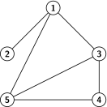
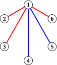
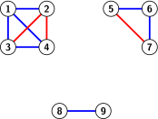
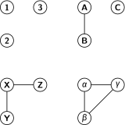

# 13 Verkot

Tekijä

Olli Järviniemi

## 13.1 Johdanto

Verkoilla voidaan kuvailla asioita ja niiden välisiä yhteyksiä. Idean yksinkertaisuudesta huolimatta on paljon vaikeita ja mielenkiintoisia verkkoaiheisia tehtäviä. Tässä tekstissä annetaan muutama esimerkki.

## 13.2 Perusidea

Tutkitaan seuraavia tilanteita:

- Jotkin ihmiset ovat ystävyksiä keskenään.
- Jotkin tietokoneet ovat yhteydessä toisiinsa.
- Joistakin kaupungeista on teitä toisiinsa.
- Jotkin jalkapallojoukkueet pelaavat toisiaan vastaan.

Pelkistettynä jokaisessa tilanteessa on kyse asioista, joiden välillä on yhteyksiä. Tällaisia tilanteita voidaan kuvata **verkoilla**. Alla on esimerkki verkosta.

*Kuva 13.1: Esimerkki verkosta.*

Kuvan verkossa on viisi **solmua** (numeroitu $1, 2, 3, 4, 5$). Niiden välisiä yhteyksiä on havainnollistettu kuvissa janoilla. Näitä janoja kutsutaan verkon **kaariksi**. Kuvan [13.1](#fig-verkko-esimerkki) verkossa on kuusi kaarta.

Verkkojen piirtäminen on hyvä tapa visualisoida tehtävissä esiintyviä tilanteita. Piirtäessä ei ole väliä, mihin paikkoihin solmut piirtää. Oleellista on vain, mitkä solmut on yhdistetty toisiinsa kaarella. (Eli solmut kannattaa piirtää sellaisiin paikkoihin, että kuva on selkeä.)

## 13.3 Esimerkkitehtäviä

**Tehtävä 13.1** Luvuista $1, 2, 3, \ldots, 20$ valitaan jokin määrä lukuja niin, ettei minkään kahden eri luvun tulo ole kokonaisluvun neliö. Kuinka monta lukua voidaan enimmillään valita?

Tehtävää voisi olla vaikea tunnistaa verkkotehtäväksi, ellei se esiintyisi verkkoja käsittelevässä tekstissä. Ideana on yhdistää kaksi lukua kaarella, jos niiden tulo on neliöluku. Tästä saadaan verkko, jonka kautta tehtävää on helpompi hahmottaa. Pienen työn jälkeen saadaan aikaan seuraava verkko:

*Kuva 13.2: Tehtävän tilannetta vastaava verkko.*

Huomaa, että ensimmäisessä verkon ”osassa” (puhutaan verkon **komponenteista**) on neliöluvut, toisessa luvut muotoa ”kaksi kertaa neliöluku”, seuraavassa luvut muotoa ”kolme kertaa neliöluku” ja niin edelleen.

Nyt tehtävä on aivan helppo! Emme saa valita kahta lukua, joita vastaavat solmut on yhdistetty toisiinsa kaarella. Tämä tarkoittaa, että kustakin komponentista voidaan valita enintään yksi solmu. Muuten voimme valita lukuja miten haluamme.

Komponentteja on $12$ kappaletta, joten vastaus tehtävään on $12$. (Yksi tapa valita luvut on ottaa joka komponentista komponentin pienin luku, jolloin saadaan luvut $1, 2, 3, 5, 7, 10, 11, 13, 14, 15, 17$ ja $19$.)

**Kommentti.** Tämä tehtävä demonstroi verkkojen yleishyödyllisyyttä. Vaikka tehtävässä mikään ei suoraan vihjaa verkkoihin, on tässä tapauksessa silti hyödyllistä ajatella ongelmaa verkkojen kautta.

Tämä tehtävä olisi hyvin voinut esiintyä myös [Laatikkoperiaate](05%20Laatikkoperiaate.md)-tekstissä. Verkkojen virka oli visualisoida, miten laatikkoperiaatteen laatikot valitaan.

**Tehtävä 13.2** Kuusi henkilöä tapaavat juhlissa. Osoita, että on olemassa jotkin kolme henkilöä, joista kaikki tuntevat toisensa, tai jotkin kolme henkilöä, joista ketkään kaksi eivät tunne toisiaan.

Tutkitaan tilannetta verkkona ja piirretään kahden solmun välille punainen kaari, jos kyseiset henkilöt tuntevat toisensa ja sininen kaari, jos he eivät tunne toisiaan. Haluamme osoittaa, että verkosta löytyy punainen tai sininen kolmio.

Tutkitaan solmusta $1$ lähteviä kaaria.

*Kuva 13.3: Solmusta $1$ lähtevät kaaret (yksi esimerkki).*

Koska värejä on kaksi ja kaaria on viisi, on kaarien joukossa (laatikkoperiaatteen nojalla) vähintään kolme samanväristä kaarta. Symmetrian vuoksi voidaan olettaa, että nämä kaaret ovat punaisia. Tutkitaan näitä kaaria vastaavia solmuja (kuvan [13.3](#fig-verkko-ramsey) esimerkissä solmuja $2, 3$ ja $6$). Jos solmuista jotkin kaksi on yhdistetty punaisella kaarella toisiinsa, muodostavat nämä kaksi solmua punaisen kolmion yhdessä solmun $1$ kanssa. Muussa tapauksessa solmut muodostavat keskenään sinisen kolmion. Olemme valmiit.

**Tehtävä 13.3** Kaupunkien välillä liikennöi kaksi eri junayhtiötä. Minkä tahansa kahden kaupungin välillä on jommankumman junayhtiön yhteys. Yhteydet ovat kaksisuuntaisia. Osoita, että vähintään toisella junayhtiöistä on seuraava ominaisuus: mistä tahansa kaupungista pääsee matkustamaan junayhtiön junilla mihin tahansa toiseen kaupunkiin (mahdollisesti useamman vaihdon kautta).

*Kuva 13.4: Kaupunkeja ja niiden välisiä junayhteyksiä. Tässä esimerkissä punainen junayhtiö toteuttaa tehtävän väitteen.*

Tehtävään esitetään kaksi erilaista ratkaisua.

**Ratkaisu 1** (suora päättely). Tutkitaan tilannetta verkkona, jossa on sinisiä ja punaisia kaaria. Jos siniset kaaret toteuttavat tehtävänannon väitteen, olemme valmiit. Tutkitaan tapausta, jossa näin ei ole.

Mitä tämä tarkoittaa? Tämä tarkoittaa, että solmut voidaan jakaa vähintään kahteen erilliseen osaan niin, ettei niiden välillä ole sinisiä kaaria. Esimerkiksi yllä olevassa kuvassa solmut $1, 3, 4, 5$ muodostavat yhden osan ja solmu $2$ omansa. Alla on vielä kuva toisenlaisesta tilanteesta.

*Kuva 13.5: Jos sininen junayhtiö ei kelpaa, voidaan kaupungit jakaa osiin niin, että eri komponenttien välillä on vain punaisia kaaria (ei piirretty kuvaan).*

Tämä tarkoittaa, että punaisia kaaria on jossain mielessä paljon. Todistus on aika helppo saada maaliin. Otetaan jotkin kaksi solmua $A$ ja $B$. Osoitetaan, että niistä pääsee punaisia kaaria pitkin toisiinsa. Tutkitaan kahta tapausta.

*Tapaus 1: $A$:sta ja $B$:stä ei pääse sinisiä kaaria pitkin toisiinsa.* Tällöin erityisesti solmujen $A$ ja $B$ välinen kaari on punainen, ja olemme valmiit.

*Tapaus 2: $A$:sta ja $B$:stä pääsee sinisiä kaaria pitkin toisiinsa.* Tässä tapauksessa $A$ ja $B$ kuuluvat samaan verkon komponenttiin. Olkoon $C$ jonkin muun komponentin solmu. (Esimerkiksi jos kuvan [13.5](#fig-verkko-junatodistus) tilanteessa $A$ on solmu $1$ ja $B$ on solmu $4$, voidaan valita $C$ olemaan vaikkapa solmu $8$.) Koska $A$ ja $C$ ovat eri komponenteissa, niiden välillä on punainen kaari. Vastaavasti solmujen $B$ ja $C$ välillä on punainen kaari. Täten $A$:sta pääsee $B$:hen solmun $C$ kautta, ja olemme valmiit.

**Ratkaisu 2** (induktiivinen päättely). Väite on selvä yhden, kahden ja kolmen kaupungin tapauksissa.

Oletetaan, että väite pätee $n$:n kaupungin tapauksessa. Tutkitaan tilannetta, jossa kaupunkeja on $n+1$. Numeroidaan kaupungit $1, 2, \ldots, n+1$.

Unohdetaan kaupunki $n+1$ hetkeksi. Tiedämme, että väite pätee kaupungeille $1, 2, \ldots, n$. Tutkitaan tapausta, jossa mistä tahansa näistä kaupungeista voi matkustaa toiseen kaupunkiin käyttämällä vain sinisiä yhteyksiä.

Nyt jos $n+1$ on yhdistetty sinisellä kaarella vähintään yhteen solmuista $1, 2, \ldots, n$, olemme valmiit: tällöin sinisillä yhteyksillä pääsee mihin tahansa solmuun.

Muussa tapauksessa solmu $n+1$ on yhdistetty kaikkiin muihin solmuihin punaisella kaarella. Tällöin matkustaminen onnistuu punaisten junayhteyksien avulla.

Eli induktiivisesti väite pätee aina yhtä suuremmilla kaupungeilla, joten väite pätee yleisesti.

## 13.4 Tehtäviä

Alla olevissa tehtävissä oletetaan, että ystävyys on molemminpuoleista (eli jos $A$ on henkilön $B$ ystävä, niin myös henkilö $B$ on henkilön $A$ ystävä). Lisäksi oletetaan, että henkilö ei ole ystävä itsensä kanssa.

**Tehtävä 1.** Kuuden henkilön ihmisjoukossa jotkut henkilöt ovat ystäviä keskenään. Onko mahdollista, että jokaisella henkilöllä on tasan neljä ystävää?

**Tehtävä 2.** Anna esimerkki viiden henkilön ihmisjoukosta ja niiden välisistä ystävyyssuhteista niin, että seuraavat ehdot toteutuvat:

- Jos valitaan mitkä tahansa kolme henkilöä, he eivät kaikki ole ystävyksiä keskenään
- Jos valitaan mitkä tahansa kolme henkilöä, heistä jotkin ovat ystäviä keskenään

**Tehtävä 3.** Viiden henkilön ihmisjoukossa jotkut henkilöt ovat ystäviä keskenään. Onko mahdollista, että jokaisella henkilöllä on pariton määrä ystäviä?

**Tehtävä 4.** Kuuden solmun verkosta tiedetään, että se on **yhtenäinen**, eli että mistä tahansa solmusta pääsee mihin tahansa toiseen solmuun kaaria pitkin. Kuinka monta kaarta verkossa voi vähimmillään olla?

**Tehtävä 5.** Kuuden solmun verkosta tiedetään, että se ei ole yhtenäinen. Kuinka monta kaarta verkossa voi enimmillään olla?

**Tehtävä 6.** Kuuden henkilön ihmisjoukossa jotkut henkilöt ovat ystäviä keskenään. Tiedetään, että jos valitaan mitkä tahansa kolme henkilöä, heistä jotkin kaksi eivät ole ystäviä keskenään. Kuinka monta ystävyyssuhdetta ihmisten vällilä voi enimmillään olla?

**Tehtävä 7.** Seuraavat kaksi verkkoa voivat nopealla vilkaisulla näyttää erilaisilta, mutta todellisuudessa ne ovat sama verkko. Verkot on vain piirretty ja solmut nimetty eri tavoilla. Solmu $1$ vastaa solmua $B$, solmu $2$ solmua $C$, solmu $3$ solmua $D$ ja solmu $4$ solmua $A$. Kaksi solmua ensimmäisessä verkossa ovat yhteydessä toisiinsa täsmälleen silloin, kun niitä vastaavat solmut toisessa verkossa on yhteydessä toisiinsa.

*Kaksi isomorfista verkkoa*

Kuinka monta neljän solmun verkkoa on olemassa, jotka ovat ”oikeasti erilaisia”, eli niitä ei ole saatu vain nimeämällä solmuja ja piirtämällä verkko eri tavalla? Esimerkiksi kolmella solmulla on olemassa neljä erilaista verkkoa:

*Neljä erilaista kolmen solmun verkkoa*

---

原文：[https://kurssi.matematiikkakilpailut.fi/13_verkot.html](https://kurssi.matematiikkakilpailut.fi/13_verkot.html)
