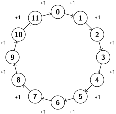

# 33 Primitiivijuurten olemassaolon todistus

Tekijä

Olli Järviniemi

## 33.1 Johdanto

Tässä tekstissä todistetaan, että jokaisella alkuluvulla $p$ on olemassa primitiivijuuri modulo $p$. Aloitamme parin työkalun esittelyllä ennen kuin pääsemme varsinaisen todistuksen kimppuun.

Todistus on vaikea. Lopussa olevat tehtävät tukevat ideoiden ymmärtämistä. Niitä kannattaa tehdä samalla, kun yrittää sisäistää todistuksen ideoita.

## 33.2 Lagrangen lause

Todistus tulee hyödyntämään seuraavaa tulosta.

**Lause 33.1 (Lagrangen lause)** Olkoon $p$ alkuluku ja olkoon $P(x)$ polynomi, jonka kertoimet ovat kokonaislukuja. Oletetaan, että kaikki $P$:n kertoimet eivät ole jaollisia $p$:llä. Tällöin yhtälöllä $$P(x) \equiv 0 \pmod{p}$$ on enintään $P$:n asteen verran (erisuuria) ratkaisuja modulo $p$.

Tilanne on siis sama kuin tavallisessa modulottomassa tapauksessa: polynomilla on enintään asteensa verran nollakohtia. Tulos ei siis ole kovin epäintuitiivinen. Huomaa kuitenkin, että ratkaisuja voi olla alle asteen verran. Esimerkiksi yhtälöllä $x^2 + 1 \equiv 0 \pmod{3}$ ei ole yhtäkään ratkaisua.

”Tavallisilla luvuilla” vastaavan väitteen voi todistaa käyttämällä polynomien jakoyhtälöä: Jos astetta $n$ olevalla polynomilla $P(x)$ on nollakohta $\alpha$, niin voidaan kirjoittaa $P(x) = (x - \alpha)Q(x)$ jollain polynomilla $Q(x)$. Täten jos polynomilla $P$ olisi vähintään $n+1$ nollakohtaa $\alpha_1, \ldots, \alpha_{n+1}$, voitaisiin kirjoittaa $$P(x) = (x - \alpha_1)(x - \alpha_2) \cdots (x - \alpha_n)(x - \alpha_{n+1})R(x)$$ jollain polynomilla $R(x)$. Oikean puolen aste on vähintään $n+1$ (koska $R$ ei ole nollapolynomi), kun taas vasemman puolen aste on $n$. Tämä ei käy.

Sama todistus toimii myös kokonaisluvuilla modulo $p$. Ainoa epävarma tekijä on, toimiiko polynomien jakoyhtälö. Kuitenkin käymällä läpi polynomien jakoyhtälön todistuksen vaiheet huomataan, että kaikki vaiheista voidaan tehdä myös modulo $p$. Tämä todistaa väitteen. (Yksityiskohdat sivuutetaan.)

## 33.3 Fii-funktio

**Määritelmä 33.1** Olkoon $n$ positiivinen kokonaisluku. Määritellään $\phi(n)$ olemaan niiden kokonaislukujen $x$ määrä, joilla $1 \le x \le n$ ja $\text{syt}(x, n) = 1$.

Tätä kutsutaan fii-funktioksi (luvusta $n$). Esimerkkejä:

- $\phi(1) = 1$, koska vain $x = 1$ toteuttaa ehdot.
- $\phi(2) = 1$, koska vain $x = 1$ toteuttaa ehdot.
- $\phi(3) = 2$, koska ensimmäisen ehdon toteuttavista luvuista $x = 1, 2, 3$ toisen ehdon toteuttavat $1$ ja $2$.
- $\phi(4) = 2$, koska ensimmäisen ehdon toteuttavista luvuista $x = 1, 2, 3, 4$ toisen ehdon toteuttavat $1$ ja $3$.
- $\phi(5) = 4$, koska luvuista $x = 1, 2, 3, 4, 5$ kaikki paitsi $5$ kelpaavat.
- $\phi(6) = 2$, koska luvuista $x = 1, 2, 3, 4, 5, 6$ vain $1$ ja $5$ kelpaavat.
- $\phi(7) = 6$, koska luvuista $x = 1, 2, 3, 4, 5, 6, 7$ kaikki paitsi $7$ kelpaavat.
- $\phi(8) = 4$, koska luvuista $x = 1, 2, 3, 4, 5, 6, 7, 8$ täsmälleen parittomat kelpaavat.

Miksi haluamme tutkia fii-funktiota? Mietitään aiemmin nähtyä kuviota yhteenlaskusta modulo $12$:

*Yhteenlasku modulo $12$.*

Valitaan jokin luku $x$ ja tutkitaan lukuja $x, 2x, 3x, \ldots, 12x$. Joissain tapauksissa nämä luvut sisältävät kaikki luvuista $0, 1, 2, \ldots, 11$ modulo $12$. Yksi tällainen tapaus on tietysti $x = 1$, mutta esimerkiksi luvulla $x = 5$ on myös tämä ominaisuus: jos aloitamme ringin luvusta $5$ ja otamme viiden askeleen hyppyjä eteenpäin, saadaan luvut $$5, 10, 3, 8, 1, 6, 11, 4, 9, 2, 7, 0.$$ Joissakin tapauksissa näin ei kuitenkaan käy. Jos valitaan esimerkiksi luku $4$, saadaan vain luvut $4, 8, 0$.

Nähdään, että luvut $x, 2x, \ldots, 12x$ käyvät kaikki luvut läpi täsmälleen silloin, kun $\text{syt}(x, 12) = 1$. Fii-funktio siis kertoo, kuinka monta kuvatunlaista lukua on. Voidaan laskea, että $\phi(12) = 4$, koska luvuista $1, 2, \ldots, 12$ luvun $12$ kanssa yhteistekijättömiä ovat $1, 5, 7$ ja $11$.

Tämä on syy sille, minkä takia käsittelemme fii-funktiota. Yllä tutkittiin ominaisuuksia yhteenlaskun näkökulmasta, mutta alla tulemme käyttämään samanlaisia ideoita myös kertolaskulle.

## 33.4 Eräs fii-funktion ominaisuus

Fii-funktiosta voisi sanoa paljonkin, mutta tarvitsemme vain pari ominaisuutta. Ensimmäinen on helppo.

Jos $n$ on positiivinen kokonaisluku, niin $\phi(n) \ge 1$.

Todistus: Voidaan valita $x = 1$: tällöin $1 \le x \le n$ ja $\text{syt}(x, n) = 1$.

Sitten vaikeampi ominaisuus.

**Apulause 33.1 (Fii-funktion summa)** Olkoon $n$ positiivinen kokonaisluku. Jos summataan luvut $\phi(d)$, missä $d$ käy läpi luvun $n$ tekijät, on lopputulos $n$: $$\sum_{d \mid n} \phi(d) = n.$$

Siis esimerkiksi tapauksessa $n = 12$ lause väittää, että $$\phi(1) + \phi(2) + \phi(3) + \phi(4) + \phi(6) + \phi(12) = 12.$$ Tämä tapaus on helppo tarkistaa laskemalla.

**Todistus.** Kuinka monta on niitä kokonaislukuja $x$, joilla $1 \le x \le n$? Vastaus on tietysti $n$.

Määrän voi kuitenkin laskea toisellakin tavalla. Ideana on laskea kullekin positiiviselle kokonaisluvulle $m$, monellako kokonaisluvulla $x$ pätee $1 \le x \le n$ ja $\text{syt}(x, n) = m$. Kun summataan nämä määrät kaikilla $m$, tulee vastaukseksi $n$.

Montako näitä lukuja sitten on? Jos $m$ ei jaa lukua $n$, niin vastaus on tietysti nolla. Kysymys on siis kiinnostava vain jos $m \mid n$. Tapauksessa $m = 1$ määrä on määritelmän nojalla $\phi(n)$. Käy niin, että määrä voidaan muissakin tapauksissa esittää fii-funktion avulla.

Jotta voi olla $\text{syt}(x, n) = m$, tulee lukujen $x$ ja $n$ olla jaollisia luvulla $m$. Kirjoitetaan siis $x = my$ ja $n = mk$. Nyt $$\text{syt}(x, n) = \text{syt}(my, mk) = m \cdot \text{syt}(y, k).$$ Tulee siis päteä $\text{syt}(y, k) = 1$.

Huomataan, että kun $x$ käy läpi luvulla $m$ jaolliset luvut välillä $1 \le x \le n$, luku $y$ käy läpi kaikki luvut välillä $1 \le y \le n/m = k$. Täten niitä lukuja $1 \le y \le k$, joilla $\text{syt}(y, k) = 1$, on määritelmän nojalla $\phi(k)$.

Eli ehdot $1 \le x \le n, \text{syt}(x, n) = m$ toteuttavia $x$ on $\phi(n/m)$ (kun $m \mid n$), joten yhteensä lukuja $1 \le x \le n$ on toisaalta $$\sum_{m \mid n} \phi(n/m)$$ ja toisaalta $n$. Enää pitää huomata, että kun $m$ käy läpi luvun $n$ tekijät, niin myös $m/n$ käy läpi luvun $n$ tekijät. Jos vaikka $n = 12$ ja $m$ käy tekijät läpi järjestyksessä $$1, 2, 3, 4, 6, 12,$$ niin $n/m$ käy tekijät läpi järjestyksessä $$12, 6, 4, 3, 2, 1.$$ Täten $$\sum_{m \mid n} \phi(m) = n.$$

## 33.5 Primitiivijuuren olemassaolo

Pääsemme varsinaiseen todistukseen. Olkoon $p$ alkuluku. Todistus pyörii seuraavan kysymyksen ympärillä.

**Kysymys.** Olkoon $d$ positiivinen kokonaisluku. Kuinka monen luvun aste modulo $p$ on tasan $d$?

Tiedämme, että jokaisen luvun aste modulo $p$ jakaa luvun $p-1$ (Tehtävän 6 osa (iii) [Kertolasku kongruensseissa](25%20Kertolasku%20kongruensseissa.md) -tekstistä). Täten vastaus kysymykseen on $0$, jos $d$ ei jaa lukua $p-1$.

Tutkitaan sitten kysymystä, kun $d$ jakaa luvun $p-1$. Jos $d = p-1$, kysymys on sama kuin kysyisi montako primitiivijuurta on modulo $p$. Kysymys voi siis aluksi tuntua vaikeammalta kuin tutkittava ongelma, mutta ongelma saadaan kuitenkin ratkaistua tätä kautta.

**Väite.** Vastaus kysymykseen on joko $0$ tai $\phi(d)$.

**Väitteen perustelu.** Jos ei ole olemassa yhtään sellaista lukua modulo $p$, jonka aste on $d$, niin vastaus on $0$ ja väite pitää paikkaansa. Oletetaan siis, että modulo $p$ on vähintään yksi luku $a$, jonka aste on $d$.

Tutkitaan lukuja $a^1, a^2, \ldots, a^d$. Huomaa, että $a^d \equiv 1 \pmod{p}$. Näitä lukuja voi visualisoida $d$:n luvun rinkinä. Esimerkiksi alla olevassa kuvassa on visualisoitu tapaus $d = 12$. Vertaa kuvaa kuvaan 1. (Huomaa, että emme ota kantaa siihen, onko tässä kaikki luvut modulo $p$.)

*Luvut $a^1, a^2, \ldots, a^d$ modulo $p$ visualisoituna, kun $d = 12$. Huomaa, että $a^{12} \equiv 1 \pmod{p}$.*

Luvuista $a^1, a^2, \ldots, a^d$ tehdään seuraavat huomiot.

1. Mikä tahansa näistä luvuista korotettuna potenssiin $d$ on $1 \pmod{p}$.
2. Täten kukin luvuista $a^1, a^2, \ldots, a^d$ on yhtälön $x^d - 1 \equiv 0 \pmod{p}$ ratkaisu.
3. Ne luvut, joiden aste on tasan $d$, ovat muotoa $a^x$, missä $\text{syt}(x, d) = 1$. Näitä lukuja on $\phi(d)$ kappaletta.

Kohdan (iii) nojalla vastaus kysymykseen on vähintään $\phi(d)$. Voiko se olla suurempi? Ei: Jos on olemassa jokin luku $b$, jonka aste on $d$, on se yhtälön $x^d - 1 \equiv 0 \pmod{p}$ ratkaisu. Kohdan (ii) nojalla olemme löytäneet tälle yhtälölle jo $d$ ratkaisua. Lagrangen lauseen nojalla enempää ei ole, joten $b$ on yksi luvuista $a^1, a^2, \ldots, a^d$, joten se on otettu mukaan laskuihin kohdassa (iii).

Väite on näin ollen perusteltu.

**Paranneltu väite.** Vastaus kysymykseen on $\phi(d)$ aina, kun $d \mid p-1$.

**Parannellun väitteen perustelu.** Olkoon vastaus kysymykseen $f(d)$. Väitteen nojalla $f(d)$ on $0$ tai $\phi(d)$. Haluaisimme poissulkea vaihtoehdon $f(d) = 0$ (kun $d \mid p-1$).

Mitä tiedämme luvuista $f(d)$, kun $d$ käy läpi luvun $p-1$ tekijät? Oleellinen tieto on, että näiden lukujen summa on $p-1$: jokaisen luvuista $1, 2, \ldots, p-1$ aste on jokin luvun $p-1$ tekijä.

Seuraavaan taulukkoon on kirjattu tämä tieto sekä muita tähän mennessä saatuja tietoja luvuista $f(d)$. Taulukko on esimerkin vuoksi kirjoitettu tapaukselle $p = 13$.

<table class="compact-table">
<thead>
<tr class="header">
<th style="text-align: center;">$d$</th>
<th style="text-align: center;">$\phi(d)$</th>
<th style="text-align: center;">$f(d)$</th>
</tr>
</thead>
<tbody>
<tr class="odd">
<td style="text-align: center;">$1$</td>
<td style="text-align: center;">$1$</td>
<td style="text-align: center;">$0$ tai $1$</td>
</tr>
<tr class="even">
<td style="text-align: center;">$2$</td>
<td style="text-align: center;">$1$</td>
<td style="text-align: center;">$0$ tai $1$</td>
</tr>
<tr class="odd">
<td style="text-align: center;">$3$</td>
<td style="text-align: center;">$2$</td>
<td style="text-align: center;">$0$ tai $2$</td>
</tr>
<tr class="even">
<td style="text-align: center;">$4$</td>
<td style="text-align: center;">$2$</td>
<td style="text-align: center;">$0$ tai $2$</td>
</tr>
<tr class="odd">
<td style="text-align: center;">$6$</td>
<td style="text-align: center;">$2$</td>
<td style="text-align: center;">$0$ tai $2$</td>
</tr>
<tr class="even">
<td style="text-align: center;">$12$</td>
<td style="text-align: center;">$4$</td>
<td style="text-align: center;">$0$ tai $4$</td>
</tr>
<tr class="odd">
<td style="text-align: center;">Summa:</td>
<td style="text-align: center;">$12$</td>
<td style="text-align: center;">$12$</td>
</tr>
</tbody>
</table>

Tässä tapauksessa on selvää, että jokaisen luvuista $f(d)$ tulee olla $\phi(d)$: muutenhan oikean sarakkeen summa olisi pienempi kuin vasemman, mutta tiedämme molempien summien olevan $p-1$.

Yleisessä tapauksessa menetellään vastaavasti. Osiossa 5 todistimme, että sarakkeen $\phi(d)$ summa on $p-1$, ja totesimme juuri, että sarakkeen $f(d)$ summan tulee myös olla $p-1$. Tästä seuraa, että jokaisen luvuista $f(d)$ on oltava $\phi(d)$.

Erityisesti $f(p-1) = \phi(p-1) \ge 1$, eli on olemassa vähintään yksi primitiivijuuri modulo $p$.

## 33.6 Tehtäviä

Ensimmäisissä tehtävissä tutustutaan tarkemmin fii-funktion ominaisuuksiin, ja viimeiset tehtävät ovat soveltavampia.

**Tehtävä 1.**

1. Osoita, että jos $p$ on alkuluku, niin $\phi(p) = p-1$.
2. Osoita, että jos $p$ on alkuluku ja $k$ on positiivinen kokonaisluku, niin $\phi(p^k) = p^k - p^{k-1}$.

**Tehtävä 2.** Todista tehtävän 1 avulla, että jos $n = p^k$ on jonkin alkuluvun potenssi, niin $$\sum_{d \mid n} \phi(d) = n.$$

**Tehtävä 3.** Tämän tehtävän tavoite on osoittaa, että jos $\text{syt}(n, m) = 1$, niin $\phi(nm) = \phi(n)\phi(m)$.

1. Olkoon $1 \le x \le mn$ kokonaisluku, ja olkoot $1 \le y \le m$ ja $1 \le z \le n$ luvun $x$ jakojäännökset luvuilla $m$ ja $n$ jaettaessa. Osoita, että $\text{syt}(x, mn) = 1$, jos ja vain jos $\text{syt}(y, m) = 1$ ja $\text{syt}(z, n) = 1$.
2. Viimeistele todistus kiinalaisella jäännöslauseella.

**Tehtävä 4.** Laske $\phi(360)$.

**Tehtävä 5.** Olkoon $m > 1$ kokonaisluku, joka ei ole alkuluku. Osoita, että on olemassa polynomi $P(x)$, jonka kertoimet ovat kokonaislukuja ja jonka kaikki kertoimet eivät ole jaollisia $m$:llä ja jolla yhtälöllä $P(x) \equiv 0 \pmod{m}$ on yli $P$:n asteen verran ratkaisuja.

**Tehtävä 6.** Olkoon $p$ alkuluku. Osoita, että $$1 \cdot 2 \cdot 3 \cdot \ldots \cdot (p-1) \equiv -1 \pmod{p}.$$

**Tehtävä 7.** Olkoon $p$ alkuluku, jolla $p \equiv 3 \pmod{4}$. Oletetaan, että $x$ ja $y$ ovat kokonaislukuja, joilla $x^2 + y^2 \equiv 0 \pmod{p}$. Osoita, että $x \equiv 0 \pmod{p}$ ja $y \equiv 0 \pmod{p}$.

**Tehtävä 8. (Eulerin lause)** Olkoon $m$ positiivinen kokonaisluku ja olkoon $a$ kokonaisluku, jolla $\text{syt}(a, m) = 1$. Osoita, että $a^{\phi(m)} = 1 \pmod{m}$.

** Vihje ** Muokkaa [Kertolasku kongruensseissa](25%20Kertolasku%20kongruensseissa.md)-luvusta löytyvää Fermat’n pienen lauseen todistusta.

---

原文：[https://kurssi.matematiikkakilpailut.fi/33_primitiivijuuren_olemassaolo.html](https://kurssi.matematiikkakilpailut.fi/33_primitiivijuuren_olemassaolo.html)
