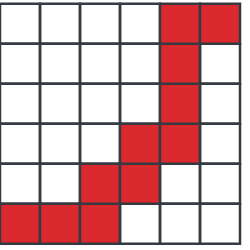
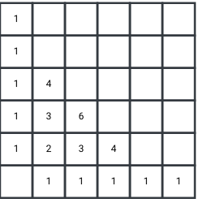
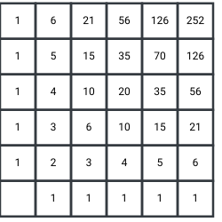

# 1 Induktiivinen päättely

    Tekijä

Olli Järviniemi

     

## 1.1 Johdanto

Yksi parhaista yleispätevistä ongelmanratkaisuohjeista on ”tutki pieniä tapauksia”. Hyödyllisyys perustuu siihen, että pienempien tapauksien kautta saadaan ymmärrystä isommista tapauksista. **Induktiivinen päättely** pyörii tämän ajatuksen ympärillä. Ideana on, että tutkimalla pieniä tapauksia ja miten tapauksesta päästään ”yhtä isompaan” tapaukseen saadaan ymmärrystä myös isommista tapauksista. Käymme läpi neljä esimerkkiä, jotka demonstroivat tätä ideaa erilaisissa ympäristöissä.

  

## 1.2 Esimerkki 1: Kävelyreitit

       

**Tehtävä 1.1** Anna aloittaa ruudusta $(0, 0)$ ja kävelee ruutuun $(5, 5)$. Anna voi aina kävellä yhden ruudun ylös tai yhden ruudun oikealle. Kuinka monta eri reittivaihtoehtoa Annalla on?

     

  

* Kuva 1.1: Yksi mahdollinen reitti, jota Anna voi kulkea. *

Vaihtoehtoja on todella monta, joten ei ole järkevää käydä niitä kaikkia yksitellen läpi. Voimme kuitenkin tutkia pieniä tapauksia eli lähellä olevia ruutuja ja miettiä, kuinka monella tavalla niihin voidaan päästä. Näitä arvoja on kohtalaisen helppo laskea, koska tapoja on paljon vähemmän.

 

  

* Kuva 1.2: Lähimpiin ruutuihin kulkevien reittien määrät. *

Taulukoinnin kautta keksitään tehtävän avainidea: se, monellako tavalla ruutuun voi päästä, on sen alapuolella ja vasemmalla puolella olevien ruutujen lukujen summa. Jos nimittäin haluamme päästä ruutuun $(x, y)$, tulee meidän sitä ennen päästä joko ruutuun $(x-1, y)$ tai $(x, y-1)$.

Nyt taulukointia on helppo jatkaa edeten vasemmasta alanurkasta kohti oikeaa ylänurkkaa. Saamme täytettyä ruudukon:

 

  

* Kuva 1.3: Mahdollisten reittien määrät jokaiselle ruudulle. *

Vastaus tehtävään on täten $252$.

**Kommentti.** Jos siis $T(x, y)$ kuvaa ruutuun $(x, y)$ päättyvien reittien määrää, niin ratkaisun idean nojalla $$T(x, y) = T(x-1, y) + T(x, y-1).$$ Tätä ideaa kutsutaan **rekursioksi**: saamme laskettua vastauksen isompaan tapaukseen pienempien tapauksien avulla. Rekursio on tärkeä esimerkki induktiivisesta päättelystä.

     

## 1.3 Esimerkki 2: Summa

       

**Tehtävä 1.2** Osoita, että  $$\begin{aligned} 1 + 2 + 3 + \ldots + n = \frac{n(n+1)}{2}, \end{aligned} \qquad(1.1)$$  kun $n$ on positiivinen kokonaisluku.

Toisin sanoen meitä pyydetään todistamaan suora kaava ensimmäisen $n$ luvun summalle. Esimerkiksi $$1 + 2 + 3 + \ldots + 100 = \frac{100 \cdot 101}{2} = 50 \cdot 101 = 5050.$$

Huomataan, että väite pätee ainakin pienillä arvoilla: $$\begin{eqnarray} 1 &=& \frac{1 \cdot 2}{2}, \\ 1 + 2 = 3 &=& \frac{2 \cdot 3}{2}, \\ 1 + 2 + 3 = 6 &=& \frac{3 \cdot 4}{2}, \\ 1 + 2 + 3 + 4 = 10 &=& \frac{4 \cdot 5}{2}. \\ \end{eqnarray}$$

Päteekö väite myös suurilla arvoilla? Tätä varten esitetään toinen kysymys, joka on kriittinen ratkaisun kannalta:

Mitä yhtälön [1.1](#eq-summa) vasemmalle ja oikealle puolelle tapahtuu, kun lukua $n$ kasvatetaan yhdellä?

**Vastaus.** Sekä vasen että oikea puoli kasvaa $n+1$ verran.

**Vastauksen perustelu.** Vasen puoli tietysti kasvaa $n+1$ verran: vasen puoli pysyy muuten samana, mutta summaan ilmestyy yksi uusi termi, nimittäin $n+1$. Oikean puolen muutosta ei ole helppo nähdä suoraan, vaan tätä varten pitää laskea. Muutos on uusi arvo miinus vanha arvo eli $$\frac{(n+1)((n+1) + 1)}{2} - \frac{n(n+1)}{2}.$$ Tämän saa helpoiten sievennettyä ottamalla $n+1$:n yhteiseksi tekijäksi: $$\frac{(n+1)((n+1) + 1)}{2} - \frac{n(n+1)}{2} = (n+1)\left(\frac{n+2}{2} - \frac{n}{2}\right) = (n+1) \cdot 1 = n+1.$$ Muutos on siis $n+1$, niin kuin pitikin.

**Mitä tästä hyötyy?** Olemme edellä tarkastaneet, että yhtälö [1.1](#eq-summa) pätee, kun $n = 1, 2, 3, 4$. Lisäksi olemme tarkastaneet, että jos lukua $n$ kasvattaa yhdellä, niin vasen ja oikea puoli muuttuvat saman verran, eli ne ovat edelleen yhtä suuria. Tästä seuraa, että yhtälö pätee myös suuremmilla $n$:n arvoilla.

Todistus on täten valmis.

**Kommentti.** Tämä on hyvin klassinen esimerkki **induktiotodistuksesta**: oletetaan, että väite pätee jollakin $n$:n arvolla, ja todistetaan, että väite pätee myös yhtä suuremmalla arvolla. Kunhan on vielä tarkistettu, että väite pätee jollakin pienellä $n$:n arvolla, pätee väite kaikilla tätä suuremmilla arvoilla. Periaatetta voi verrata tikapuihin: jos pääsemme tietylle askelmalle ja voimme aina ottaa yhden askeleen ylöspäin, pääsemme mille tahansa alkukohdan yläpuolella olevalle askelmalle.

     

## 1.4 Esimerkki 3: Väritys

       

**Tehtävä 1.3** Tasossa on suoria, jotka jakavat tason eri osiin. Osoita, että osat voi värittää mustalla ja valkoisella niin, etteivät mitkään kaksi vierekkäistä aluetta ole samanvärisiä.

Ideana on miettiä ongelmaa induktiivisesti: Pienet tapaukset (kun suoria on esimerkiksi $0, 1$ tai $2$) ovat helppoja. Mitä tapahtuu, kun kuvioon lisätään yksi suora? Jos voimme varmistaa, että aina uuden suoran lisäämisen jälkeen väritys edelleen onnistuu, niin haluttu väite pätee.

Yritetään tehdä tämä. Oletetaan siis, että olemme tähän asti saaneet värityksen aikaan esimerkiksi kolmen suoran tapauksessa.

Tutkitaan sitten tilannetta, jossa suoria on yksi enemmän.

Mitä nyt? Väritys toimii muuten, mutta uuden suoran eri puolilla on alueita, jotka ovat vierekkäisiä ja samanvärisiä. Väritystä pitää tietysti muuttaa. Vaihdetaan väriä vaikkapa niissä alueissa, jotka ovat uuden suoran vieressä sen yläpuolella. Saadaan seuraava kuvio:

Väritystä pitää tietysti muuttaa vielä muidenkin uuden suoran yläpuolella olevien alueiden kohdalla:

Tämä väritys toimii!

Eli yleisesti lisättäessä uusi suora vaihdetaan kaikkien toisella puolella suoraa olevien alueiden värit päinvastaisiksi. Tämä todella toimii: Tutkitaan joitakin kahta vierekkäistä aluetta. Jos ne ovat eri puolella uutta suoraa, ovat ne värien vaihtamisen takia erivärisiä. Jos ne ovat samalla puolella uutta suoraa, ovat ne erivärisiä, koska ne olivat ennen värien vaihtamista erivärisiä (lähdimme toimivasta värityksestä) ja värien vaihtaminen muuttaa joko molempien tai ei kummankaan alueen väriä.

**Kommentti.** Tässä on induktiivista päättelyä parhaimmillaan: Tehtävänannossa tutkitaan tilannetta, jossa on (paljon) suoria tasossa – siis vain yhtä tietynlaista asetelmaa. Voimme kuitenkin ajatella, että tähän tilanteeseen on päädytty prosessin kautta lisäämällä suoria tasoon yksi kerrallaan. Tällöin riittää vain tutkia, mitä alueiden väreille tapahtuu, kun tasoon lisätään yksi suora.

     

## 1.5 Esimerkki 4: Merkkijonot

       

**Tehtävä 1.4** Kuinka monta sellaista $5$-kirjaimista merkkijonoa on olemassa, jossa jokainen merkki on $a$, $b$ tai $c$ ja jossa ei ole missään kohtaa kahta peräkkäistä $a$-kirjainta?

Vastaus on tietysti liian iso laskettavaksi suoraan. Yritetään laskea vastaus induktiivisesti tutkimalla lyhyempiä merkkijonoja. (Vertaa esimerkkiin 1.)

Yksikirjaimisia jonoja on tietysti $3$. Kaksimerkkisiä kirjaimista $a, b, c$ koostuvia jonoja on $3 \cdot 3 = 9$ (koska ensimmäisen numeron voi valita kolmella tavalla, kuten myös toisen), ja näistä ainoastaan $aa$ ei kelpaa. Siis kelpaavia kahden merkin jonoja on $8$. Kolmimerkkisten kelpaavien jonojen määrä on jo hieman vaikeampi laskea, mutta niitä on $22$: kaikista $3 \cdot 3 \cdot 3 = 27$ merkkijonosta kelpaa kaikki paitsi $aaa, aab, aac, baa, caa$.

Mietitään sitten induktion kannalta oleellista kysymystä: kuinka paljon mahdollisten merkkijonojen määrä kasvaa, kun pituutta kasvatetaan yhdellä? Vastaus ei ole aivan yksinkertainen: jos nykyinen merkkijono loppuu $a$-kirjaimeen, voi sitä jatkaa kahdella tavalla (lisäämällä loppuun $b$:n tai $c$:n), ja jos nykyinen merkkijono loppuu $b$- tai $c$-kirjaimeen, voi sitä jatkaa kolmella tavalla.

Tästä syystä on luontevaa tutkia erikseen, kuinka moni merkkijono päättyy $a$-kirjaimeen ja kuinka moni $b$- tai $c$-kirjaimeen. Näitäkin määriä voi laskea induktiivisesti, ja määrät riippuvat yhtä merkkiä lyhyempien merkkijonojen määristä.

Laskemista varten määritellään $f(n)$ olemaan niiden $n$-kirjaimisten jonojen määrä, joissa ei ole kahta peräkkäistä $a$-kirjainta ja jotka päättyvät $a$-kirjaimeen, ja $g(n)$ olemaan niiden $n$-kirjaimisten jonojen määrä, joissa ei ole kahta peräkkäistä $a$-kirjainta ja jotka eivät pääty $a$-kirjaimeen. Tehtävän vastaus on tällöin $f(5) + g(5)$.

Määrät $f(n)$ ja $g(n)$ riippuvat toisistaan seuraavilla tavoilla:  $$f(n) = g(n-1) \qquad(1.2)$$  ja  $$g(n) = 2f(n-1) + 2g(n-1). \qquad(1.3)$$

Perustelut: Jokainen $a$-kirjaimeen päättyvä $n$-kirjaiminen jono saadaan ottamalla jokin $n-1$-merkkinen jono, joka ei pääty $a$:han, ja lisäämällä loppuun $a$-kirjain. Yhtälö [1.2](#eq-ind-f) seuraa tästä.

Jokainen $n$-kirjaiminen jono, joka ei pääty $a$-kirjaimeen saadaan ottamalla mikä vain $n-1$-kirjaiminen jono ja lisäämällä sen loppuun $b$- tai $c$-kirjain. Tästä saadaan yhtälö [1.3](#eq-ind-g).

Alkuarvot saadaan helposti: $f(1) = 1$ ja $g(1) = 2$. Käyttämällä rekursioyhtälöitä [1.2](#eq-ind-f) ja [1.3](#eq-ind-g) voimme nyt laskea luvut $f(2)$ ja $g(2)$, sitten luvut $f(3)$ ja $g(3)$ ja niin edelleen. Alla on taulukko näistä arvoista.

<table class="compact-table">
<tbody>
<tr class="odd">
<td style="text-align: right;">$f(1)=1$</td>
<td style="text-align: right;">$g(1)=2$</td>
</tr>
<tr class="even">
<td style="text-align: right;">$f(2)=2$</td>
<td style="text-align: right;">$g(2)=6$</td>
</tr>
<tr class="odd">
<td style="text-align: right;">$f(3)=6$</td>
<td style="text-align: right;">$g(3)=16$</td>
</tr>
<tr class="even">
<td style="text-align: right;">$f(4)=16$</td>
<td style="text-align: right;">$g(4)=44$</td>
</tr>
<tr class="odd">
<td style="text-align: right;">$f(5)=44$</td>
<td style="text-align: right;">$g(5)=120$</td>
</tr>
</tbody>
</table>

Vastaus on siis $44 + 120 = 164$.

  

## 1.6 Tehtäviä

**Tehtävä 1.** Lammen veden päällä on rivissä $11$ lumpeenlehteä. Sammakko on rivin ensimmäisellä lehdellä ja haluaa päästä rivin viimeiselle lumpeenlehdelle. Sammakko pystyy hyppäämään kerrallaan korkeintaan kaksi lehteä eteenpäin. Kuinka monella eri tavalla sammakko voi pomppia ensimmäiseltä lehdeltä viimeiselle?

**Tehtävä 2.** Annalla on rajaton määrä neljän ja seitsemän euron kolikoita. Mikä on suurin (kokonaisluku)rahamäärä, jota hän ei voi muodostaa kolikoilla?

**Tehtävä 3.** Laske/sievennä: $1 + 2 + 4 + 8 + \ldots + 2^{99}$.

**Tehtävä 4.** Kuinka monella tavalla $2 \times 10$ -laudan voi peittää $2 \times 1$ -dominoilla? (Dominoita saa kääntää, mutta ne eivät saa mennä toistensa päälle tai laudan ulkopuolelle.)

**Tehtävä 5.** Kuinka monta lävistäjää $100$-kulmiolla on? (Esimerkiksi nelikulmiolla on $2$ lävistäjää ja viisikulmiolla $5$.)

**Tehtävä 6.** Osoita, että kaikilla kokonaisluvuilla $n \ge 6$ pätee $2^n \ge 10n$.

**Tehtävä 7.** Tasossa on $100$ suoraa, joista mitkään kaksi eivät ole yhdensuuntaisia eivätkä mitkään kolme leikkaa samassa pisteessä. Kuinka moneen alueeseen ne jakavat tason?

**Tehtävä 8.** Kuinka monta sellaista kymmenkirjaimista merkkijonoa, jossa jokainen merkki on $a$ tai $b$ ja jossa on pariton määrä $a$ kirjaimia, on olemassa?

---

原文：[https://kurssi.matematiikkakilpailut.fi/01_induktiivinen_paattely.html](https://kurssi.matematiikkakilpailut.fi/01_induktiivinen_paattely.html)
