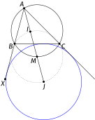

# 14 Geometriset konfiguraatiot

    Tekijä

Olli Järviniemi

     

## 14.1 Johdanto

Geometrian tehtävissä on tiettyjä usein toistuvia kuvioita. Esimerkiksi monen tehtävän pohjalla on kolmio ja sen sisäympyrä, ympärysympyrä tai korkeusjanoja. Yleisimmät konfiguraatiot kannattaa siis tuntea hyvin.

Joitakin konfiguraatioita on käsitelty jo aiemmissa teksteissä suoraan tai tehtävissä. Ehkäpä tärkeimmät tiedot ovat, että kolmiolla on ympärysympyrä (jonka keskipiste on sivujen keskinormaalien leikkauspiste) ja sisäympyrä (jonka keskipiste on kulmanpuolittajien leikkauspiste) ja että kolmion korkeusjanat leikkaavat samassa pisteessä. Lisäksi näillä kuvioilla on tiettyjä ominaisuuksia: esimerkiksi korkeusjanakuviosta löytyy paljon jännenelikulmioita.

Tässä tekstissä käsitellään lisää konfiguraatioita. Jotkin näistä, kuten kehäkulmalauseen tangenttiversio ja sisäympyrän ominaisuudet, ovat hyvin käyttökelpoisia jo kansallisen tason tehtävissä. Jotkut esiintyvät sellaisenaan vasta kansainvälisellä tasolla, mutta konfiguraatiot toimivat silti hyvinä harjoitustehtävinä.

Käytämme tässä tekstissä (ja myöhemminkin) lyhennysmerkintää $\angle BAC = \angle A$ kolmion $ABC$ kärjen $A$ kulmalle. Vastaavasti merkitään $\angle CBA = \angle B$ ja $\angle ACB = \angle C$.

  

## 14.2 Kehäkulmalauseen tangenttiversio

*Eräitä tapauksia kehäkulmalauseesta.*

Kehäkulmalauseen nojalla tiedämme, että samaa jännettä vastaavat kehäkulmat ovat yhtä suuria, eli yllä olevassa kuvassa $\angle BA_1C = \angle BA_2C = \angle BA_3C = \angle BA_4C$. Kun pisteet $A_i$ lähestyvät pistettä $B$, kulma $\angle BA_iC$ alkaa näyttää enemmän ja enemmän jänteen $BC$ ja pisteeseen $B$ piirretyn ympyrän tangentin väliseltä kulmalta.

Kulmat todella ovat yhtä suuria. Tätä kutsutaan kehäkulmalauseen tangenttiversioksi.

       

**Lause 14.1 (Kehäkulmalauseen tangenttiversio)** Olkoon $ABC$ kolmio ja olkoon $D$ piste, joka on eri puolella suoraa $BC$ kuin piste $A$ ja jolla $BD$ on tangentti kolmion $ABC$ ympärysympyrälle. Tällöin $\angle DBC = \angle BAC$.

Väite on yllä olevan perustelun nojalla uskottava, mutta tässä on väitteelle myös kunnollinen todistus.

*Kolmion $ABC$ ympärysympyrä ja tangentti $BD$.*

Kehäkulmalauseen nojalla $\angle BOC = 2\angle A$, joten tasakylkisestä kolmiosta $BOC$ saadaan $\angle CBO = 90^{\circ} - \angle A$. On tuttu juttu, että pisteeseen piirretty säde ja tangentti ovat kohtisuorassa toisiaan vastaan, eli $\angle DBO = 90^{\circ}$. Täten $$\angle DBC = \angle DBO - \angle CBO = 90^{\circ} - (90^{\circ} - \angle A) = \angle A.$$

*Kulmat merkittynä kuvioon.*

Mainitaan vielä seuraava tulos:

       

**Lause 14.2 (Kehäkulmalauseen tangenttiversion toinen suunta)** Olkoon $ABC$ kolmio ja olkoon $D$ sellainen piste eri puolella suoraa $BC$ kuin piste $A$, että $\angle DBC = \angle BAC$. Tällöin $BD$ on tangentti kolmion $ABC$ ympärysympyrälle.

Väite seuraa yksikäsitteisyysargumentilla edellisestä tuloksesta samaan tapaan kuin kehäkulmalauseen toinen puoli saadaan kehäkulmalauseesta. Yksityiskohdat lyhyesti: Olkoon $D$ lauseen mukainen piste. Valitaan piste $D'$ tangentilta ja käytetään edellistä tulosta, jolloin saadaan $$\angle DBC = \angle BAC = \angle D'BC.$$ Täten $B, D$ ja $D'$ ovat samalla suoralla, eli $D$ on halutulla tangentilla.

  

## 14.3 Sisäympyrä

Tutkitaan kolmiota $ABC$, sen sisäympyrää ja ympyrän sivuamispisteitä kolmion sivujen kanssa.

 

  

* Kuva 14.1: Kolmion sisäympyrä ja sivuamispisteitä. *

Kuviosta löytyy jännenelikulmioita: $AFIE$ ja symmetrisesti $BDIF$ ja $CEID$. Muutenkin kulmia osataan laskea kohtuullisen hyvin: pätee esimerkiksi $\angle BIC = 90^{\circ} + \angle A/2$ ja $\angle EDF = 90^{\circ} - \angle A/2$. (Todistukset jätetään tehtäväksi 1.)

Tässä on pari hieman vaikeampaa huomiota.

 

**Apulause 14.1** Jos $T$ on kolmion $ABC$ pinta-ala ja $r$ on sisäympyrän säde, niin $$T = r \cdot \frac{AB + BC + CA}{2}.$$

Todistuksen idea on hauska. Toisaalta kolmion $ABC$ pinta-ala on määritelmän nojalla $T$. Toisaalta pinta-ala voidaan laskea kolmioiden $AIB, BIC$ ja $CIA$ pinta-alojen summana. Kolmion $AIB$ pinta-ala on kanta $AB$ kertaa korkeus $FI = r$ jaettuna kahdella eli $r \cdot AB/2$. Samaan tapaan saadaan kahden muun pikkukolmion pinta-alat. Summaamalla saadaan lemman tulos.

 

**Apulause 14.2** Pätee $$AF = \frac{AB + AC - BC}{2}.$$

Siis pituus $AF$ osataan laskea. Vastaavasti myös pituudet $FB, BD, DC, CE$ ja $EA$ osataan laskea.

Todistusta varten huomataan ensin, että $AF$ ja $AE$ ovat samasta pisteestä piirrettyjä tangentteja ympyrälle, joten ne ovat yhtä pitkiä.[^1](#fn1) Merkitään $x = AF$, $y = BD$ ja $z = CE$. Ideana on pystyttää yhtälöryhmä luvuille $x, y$ ja $z$.

 

^1 Tarkka perustelu: Kulmat $\angle AFI$ ja $\angle AEI$ ovat suoria ja $IF = IE$. Täten kolmiot $AFI$ ja $AEI$ ovat suorakulmaisia kolmioita, joiden yhdet kateetit ja hypotenuusat ovat yhtä pitkiä, joten myös toiset kateetit ovat yhtä pitkiä.

*Kuvio [14.1](#fig-sisäympyrä) täydennettynä tarvittavilla pituuksilla.*

Tutkimalla kuviota luvuille $x, y$ ja $z$ saadaan yhtälöt $$x + y = AB,$$ $$y + z = BC$$ ja $$z + x = AC.$$ Loppu onkin algebrallista manipulaatiota. Summataan ensimmäinen ja kolmas yhtälö ja vähennetään tuloksesta keskimmäinen yhtälö. Saadaan $$(x+y) + (z+x) - (y+z) = AB + AC - BC,$$ mistä sieventämällä saadaan haluttu tulos.

  

## 14.4 Sivuympyrät

Palautetaan mieleen seuraava konfiguraatio yhdestä aiemmasta tehtävästä: jos $M$ on kolmion $ABC$ ympärysympyrän kaaren $BC$ keskipiste, niin $M$ on suoralla $AI$ ja $M$ on yhtä kaukana pisteistä $B, I$ ja $C$ (missä $I$ on kolmion sisäympyrän keskipiste).

*$M$ on kolmion $BIC$ ympärysympyrän keskipiste.*

Jatketaan suoraa $AI$ pisteen $M$ yli kolmion $BIC$ ympärysympyrälle:

*Tutkitaan pistettä $J$.*

Nyt $IJ$ on ympyrän halkaisija, joten $IBJ$ on suora kulma. Koska $\angle CBI = \angle B / 2$, niin $\angle JBC = 90^{\circ} - \angle B / 2$. Tämä tarkoittaa, että $BJ$ on kulman $\angle ABC$ vieruskulman puolittaja: jos jatkamme janaa $AB$ pisteen $B$ yli johonkin pisteeseen $X$, niin $BJ$ puolittaa kulman $\angle XBC$.

Tästä seuraa, että $J$ on yhtä kaukana suorista $BC$ ja $BX$. Vastaavasti $J$ on yhtä kaukana suorista $BC$ ja janan $AC$ jatkeesta. Voidaan siis piirtää $J$-keskinen ympyrä, joka sivuaa näitä suoria. Tätä ympyrää kutsutaan kolmion $ABC$ (kärjen $A$ vastaiseksi) **sivuympyräksi**.

*Piste $J$ on kärjen $A$ vastaisen sivuympyrän keskipiste.*

Kerätään tulokset seuraavaan lauseeseen.

       

**Lause 14.3 (Sivuympyröiden peruslause)** Olkoon $ABC$ kolmio, $I$ sen sisäympyrän keskipiste ja $M$ kolmion ympärysympyrän kaaren $BC$ keskipiste. Olkoon $J$ pisteen $I$ peilaus pisteen $M$ yli. Tällöin

- $J$ on kolmion $ABC$ kärjen $A$ vastaisen sivuympyrän keskipiste
- $BICJ$ on jännenelikulmio, jossa kulmat $\angle JBI$ ja $\angle ICJ$ ovat suoria
- $BJ$ puolittaa kulman $\angle CBA$ vieruskulman.
      

## 14.5 Tehtäviä

**Tehtävä 1.** Osoita, että kuvan [14.1](#fig-sisäympyrä) tilanteessa $AFIE$ on jännenelikulmio, että $\angle BIC = 90^{\circ} + \angle A/2$ ja että $\angle EDF = 90^{\circ} - \angle A/2$.

**Tehtävä 2.** Nelikulmiolla $ABCD$ on sisäympyrä (eli nelikulmion sisällä oleva ympyrä, joka sivuaa kaikkia nelikulmion sivuja). Osoita, että $AB + CD = BC + AD$.

*Tehtävä 2.*

(Voidaan myös osoittaa, että jos konveksilla[^2](#fn2) nelikulmiolla $ABCD$ pätee $AB + CD = BC + AD$, niin sillä on sisäympyrä.)

 

^2 Monikulmiota kutsutaan konveksiksi, jos sen kaikki kulmat ovat alle $180$ astetta.

**Tehtävä 3.** Janat $BE$ ja $CF$ ovat kolmion $ABC$ korkeusjanoja. Piste $M$ on janan $BC$ keskipiste.

1. Osoita, että $MB = MF$, $MF = ME$ ja $ME = MC$.
2. Osoita, että janat $ME$ ja $MF$ ovat tangentteja kolmion $AEF$ ympärysympyrälle.

*Tehtävä 3.*

**Tehtävä 4.** Olkoon $ABC$ kolmio, jonka korkeusjanat $AD, BE$ ja $CF$ leikkaavat pisteessä $H$.

1. Olkoon $X$ janan $AH$ keskipiste. Osoita, että $DEXF$ on jännenelikulmio.
2. Olkoon $M$ janan $BC$ keskipiste. Osoita, että $DMEF$ on jännenelikulmio.

*Tehtävä 4.*

(Vastaavasti myös janojen $BH$, $CH$, $AC$ ja $AB$ keskipisteet ovat kolmion $DEF$ ympärysympyrällä. Tällä ympyrällä on siis peräti yhdeksän ”tärkeää” pistettä: $D, E$ ja $F$, janojen $AH, BH$ ja $CH$ keskipisteet ja janojen $BC, AC$ ja $AB$ keskipisteet. Ympyrää kutsutaankin kolmion $ABC$ **yhdeksän pisteen ympyräksi**.)

**Tehtävä 5.** Kolmion $ABC$ ympärysympyrällä on piste $D$. Pisteet $X, Y$ ja $Z$ ovat pisteestä $D$ suorille $BC, AC$ ja $AB$ piirrettyjen korkeusjanojen kannat. Osoita, että $X, Y$ ja $Z$ ovat samalla suoralla.

*Tehtävä 5.*

(Suoraa kutsutaan **Simsonin suoraksi**.)

---

原文：[https://kurssi.matematiikkakilpailut.fi/14_konfiguraatiot.html](https://kurssi.matematiikkakilpailut.fi/14_konfiguraatiot.html)
