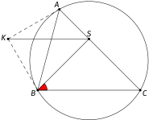
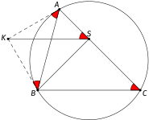
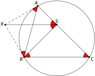
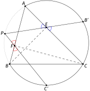
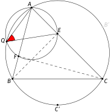
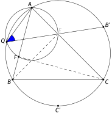

# 20 Kulmanjahtaus

    Tekijä

Olli Järviniemi

     

## 20.1 Johdanto

Kyky jahdata kulmia on ehkäpä tärkein yksittäinen taito geometrian tehtävissä. Tästä syystä tässä tekstissä käsitellään erikseen tätä taitoa. Kilpailutehtävissä voi tietysti tarvita laajempaakin määrää työkaluja, mutta tämän tekstin tehtävät on valittu nimenomaan kulmanjahtausta silmällä pitäen.

Tekstissä ei sinänsä ole uutta teoriaa, mutta on muutama hyödyllinen idea, joita demonstroidaan kolmen esimerkin kautta.

  

## 20.2 Esimerkki 1

       

**Tehtävä 20.1** Olkoon $\omega$ teräväkulmaisen kolmion $ABC$ ympärysympyrä. Leikatkoot ympyrän $\omega$ pisteisiin $A$ ja $B$ piirretyt tangentit pisteessä $K$. Olkoon $S$ se piste suoralla $AC$, jolla $KS || BC$. Osoita, että $BS = CS$.

*Kuva 1: Osoitetaan, että $SBC$ on tasakylkinen kolmio.*

Ehto $BS = CS$ on luontevinta tulkita niin, että $BSC$ on tasakylkinen kolmio eli että kulmat $\angle CBS$ ja $\angle SCB$ ovat yhtä suuret. Voidaan ajatella, että kulma $\angle SCB$ ”tiedetään”: se on kolmion $ABC$ kulma $\angle C$. Keskitytään siis kulman $\angle CBS$ laskemiseen.

*Kuva 2: Lasketaan $\angle CBS$.*

Yksi idea on käyttää janojen $KS$ ja $BC$ yhdensuuntaisuutta ja saada $\angle CBS = \angle KSB$. Kulmasta $\angle KSB$ ei kuitenkaan tunnu pääsevän oikein eteenpäin. Mikä neuvoksi?

Haluamme jotenkin hyödyntää sitä, että $K$ on pisteisiin $A$ ja $B$ piirrettyjen tangenttien leikkauspiste, mutta tämän hyödyntäminen ei onnistu suoraan. Joka tapauksessa tätä kautta saa laskettua kehäkulmalauseen tangenttiversion avulla kulmia (esimerkiksi $\angle KAB = \angle C$). Alla olevaan kuvaan on merkitty kulmia, jotka osataan laskea.

*Kuva 3: Merkityt kulmat ovat yhtä suuria.*

Kulma $\angle ASK$ on laskettu hyödyntämällä janojen $KS$ ja $BC$ yhdensuuntaisuutta.

Tästä huomataan, että $\angle ABK = \angle ASK$, eli $KASB$ on jännenelikulmio! Tämän seurauksena kehäkulmalauseella saadaan laskettua $\angle KSB = \angle KAB$, ja tästä edelleen yhdensuuntaisuudella $\angle CBS = \angle KSB$.

*Kuva 4: Jännenelikulmio $KASB$ antaa lisää kulmia.*

Väite seuraa.

**Kommentti.** Tehtävä koostuu kahdesta askeleesta: ensiksi todistetaan, että $KASB$ on jännenelikulmio, ja sitten lasketaan halutut kulmat. **On tärkeä taito löytää kuvioista jännenelikulmioita**, ja yleisesti oikeiden huomioiden/väitteiden tekeminen kuviosta on tärkeää. Tehtävien vaikeutuessa tulee tehdä useampia ja vaikeampia huomioita (tarvittavien askelien määrä onkin yksi tapa mitata, kuinka vaikea tehtävä on).

Tästä syystä on hyödyllistä tutkiskella kuviota erikseen ja yrittää keksiä, onko siinä jotakin erikoista: näyttävätkö jotkin neljä pistettä olevan samalla ympyrällä tai jotkin kolme pistettä olevan samalla suoralla, leikkaavatko jotkin kolme suoraa samassa pisteessä, ovatko jotkin kaksi kulmaa yhtä suuria tai jotkin kaksi janaa yhtä pitkiä, onko tuo kulma $90$ astetta, onko tuo suora itse asiassa tangentti tuolle ympyrälle…

Huomioiden keksimistä varten voi välillä hetkellisesti olettaa tehtävänannon väitteen pätevän ja yrittää siitä johtaa muita väitteitä (esimerkiksi ”jos tehtävänannon väite pätee, niin $XYZW$ on jännenelikulmio”). Usein päättelyn voi tällöin vetää myös toiseen suuntaan (”jos $XYZW$ on jännenelikulmio, niin tehtävänannon väite pätee”), mikä voi antaa edistystä. Tätä ideaa hyödynnetään alla esimerkissä 3.

     

## 20.3 Esimerkki 2

       

**Tehtävä 20.2** Olkoot $B'$ ja $C'$ sellaisia pisteitä kolmion $ABC$ ympärysympyrällä, että $AB = AB'$ ja $AC = AC'$. Olkoot $E$ ja $F$ kolmion $ABC$ kärjistä $B$ ja $C$ piirrettyjen korkeusjanojen kantapisteet. Osoita, että $BB', CC'$ ja $EF$ ovat yhdensuuntaisia.

*Kuva 5: Kolme yhdensuuntaista suoraa*

Tehtävä koostuu kahdesta väitteestä: osoita, että $BB'$ ja $CC'$ ovat yhdensuuntaisia, ja osoita, että $BB'$ ja $EF$ ovat yhdensuuntaisia. Keskitytään väitteisiin yksi kerrallaan.

Suorien $BB'$ ja $CC'$ yhdensuuntaisuutta koskeva väite ei koske pisteitä $E$ ja $F$, joten ne voidaan unohtaa. Voimme oikeastaan unohtaa myös kolmion $ABC$: oleellista on vain se, että erään ympyrän kehällä on viisi pistettä $A, B, B', C$ ja $C'$, joiden välisistä kaarien pituuksista tiedämme jotakin ($AB = AB'$ ja $AC = AC'$).

*Kuva 6: Kuva, josta on poistettu kaikki turha.*

Tiedämme siis, että kaaret $AB$ ja $AB'$ ovat keskenään yhtä pitkiä, kuten ovat myös $AC$ ja $AC'$. Vähennyslaskulla seuraa, että kaaret $BC'$ ja $B'C$ ovat yhtä pitkiä. Väite seuraa tästä: näitä kaaria vastaavat kehäkulmat ovat täten myös yhtä pitkiä, joten $\angle BCC' = \angle CBB'$, eli $BB'$ ja $CC'$ ovat (samankohtaisten kulmien nojalla) yhdensuuntaiset.

Tutkitaan sitten suorien $BB'$ ja $EF$ yhdensuuntaisuutta. Tässä vaiheessa voimme unohtaa pisteen $C'$.

*Kuva 7: Yksinkertaistetaan kuvaa poistamalla $C'$.*

Tämäkään osaongelma ei ole vaikea: Tiedämme, missä kulmassa $EF$ on, koska kolmiota ja sen korkeusjanoja koskevasta kuviosta pystymme laskemaan kaikki kulmat. Tiedämme myös, ”missä” $B'$ on. Osaamme nimittäin laskea esimerkiksi kulman $\angle CBB'$: pätee $$\angle CBB' = \angle B - \angle B'BA = \angle B - \angle C,$$ koska $\angle B'BA$ vastaa kaarta $AB'$, jonka pituus on sama kuin kaaren $AB$, joka vastaa kulmaa $\angle C$.

Siis $BB'$ on kulmassa $\angle B - \angle C$ suoraan $BC$ nähden. Voimme viimeistellä ratkaisun laskemalla, kuinka suuressa kulmassa $EF$ on suoraan $BC$ nähden. Täydennetään tätä varten kuvaan suorien $EF$ ja $BC$ leikkauspiste.

*Kuva 8: Lisätään uusi piste ja poistetaan tarpeettomaksi muuttunut $B'$.*

Tavoitteena on laskea $\angle CXE$. Tämä onnistuu esimerkiksi kolmiosta $XEC$: yksi kolmion kulmista on $\angle C$, ja jännenelikulmion $BFEC$ nojalla toinen on $\angle FEC = 180^{\circ} - \angle B$. Tästä seuraa, että $\angle CXE = \angle B - \angle C$.

Siis $EF$ ja $BC$ ovat samassa kulmassa suoraan $BC$ nähden (eli $\angle CXE = \angle CBB'$), joten ne ovat yhdensuuntaiset.

**Kommentti.** Ratkaisussa havainnollistettiin seuraavia ideoita.

Ensinnäkin kannattaa jakaa tehtävä palasiin ja kuvia piirtäessä keskittää huomiota oleellisiin osiin. On miltei aina hyvä, jos voi muotoilla tehtävän uudelleen niin, ettei joitakin aiemmin esiintyneitä pisteitä enää tarvita: tehtävä on nyt yksinkertaisempi. Tämä kannattaa ottaa myös kuvien piirtämisessä huomioon. On helpompi nähdä seuraava askel, kun kuviossa on vähemmän pisteitä, suoria ja ympyröitä.

Toiseksi on joskus hyödyllistä miettiä kulmia ympyrän kaarien pituuksien kautta. Tämä idea soveltuu erityisesti sellaisissa tilanteissa, joissa saman ympyrän kehällä on monta pistettä. Hyöty on siinä, että pisteiden muodostamia kulmia on hyvin monta[^1](#fn1) ja niitä on siten vaikea hahmottaa, kun taas ympyrän kaaria on helppo käsitellä.

Kolmannekseen suorien yhdensuuntaisuutta voi miettiä sitä kautta, missä kulmassa suorat ovat kuvassa. Kyse on vain samankohtaisista kulmista, mutta hieman eri näkökulmasta tutkittuna.Tätä kautta voi esimerkiksi helpommin keksiä lisätä pisteen $X$ kuvaan 8 (verrattuna jos yrittäisi suoraan soveltaa samankohtaisia kulmia kuvan 7 tilanteeseen, jolloin voisi päätyä tutkimaan vaikkapa ehtoa $\angle FEB = \angle B'BE$).

Näillä kolmella idealla on yhteinen teema: kukin koskee sitä, mihin kuviossa kiinnittää huomiota ja miten sitä hahmottaa. Esimerkkitehtävä on melko helppo, joten ideat eivät ole välttämättömiä tehtävän ratkaisemiseksi, mutta tämä on sivuseikka. Geometriassa on hyödyllistä kyetä katsomaan kuviota monella eri tavalla, jolloin saa monenlaisia ideoita tehtävän ratkaisemiseksi.

    

^1 Esimerkiksi jos pisteitä on kuusi, niin niiden välisiä kulmia on $6 \cdot {5 \choose 2} = 60$ kappaletta, kun taas ympyrän kaaren pätkiä on laskentatavasta riippuen vain $6$ tai ${6 \choose 2} = 15$.

 

## 20.4 Esimerkki 3

Seuraava tehtävä on jatkoa esimerkin 2 tehtävälle.

       

**Tehtävä 20.3** Olkoot $B'$ ja $C'$ sellaisia pisteitä kolmion $ABC$ ympärysympyrällä, että $AB = AB'$ ja $AC = AC'$. Olkoot $E$ ja $F$ kolmion $ABC$ kärjistä $B$ ja $C$ piirrettyjen korkeusjanojen kantapisteet. Olkoon $P$ suorien $B'E$ ja $C'F$ leikkauspiste. Osoita, että $P$ on kolmion $ABC$ ympärysympyrällä.

*Kuva 9: Osoitetaan, että $P$ on kolmion $ABC$ ympärysympyrällä.*

On monia tapoja uudelleenmuotoilla väite kulmaehtojen avulla: $P$ on kolmion $ABC$ ympärysympyrällä, jos esimerkiksi $APC'B'$ on jännenelikulmio eli jos $\angle C'PB' = \angle C'AB'$.

Kulman $\angle C'AB'$ saa kyllä laskettua. Kuten edellisessä esimerkissä (kuva 6), kannattaa kiinnittää huomio kolmion $ABC$ ympärysympyrän kehälle ja miettiä kulmia kaarien kautta. Koska kaaret $BC'$ ja $CB'$ ovat edellisen ratkaisun nojalla yhtä pitkiä, pätee $$\angle C'AB' = \angle C'AC + \angle CAB' = \angle C'AC + \angle BAC' = \angle A.$$

Täten jäljelle jää osoittaa, että $\angle C'PB' = \angle A$. Tämä ehto on luontevaa tulkita niin, että $PFEA$ on jännenelikulmio(!). Saamme siis valinnanvaraa siihen, minkä kulmaehdon todistamme: nyt riittäisi osoittaa esimerkiksi $\angle AFP = \angle AEP$.

*Kuva 10: Riittää osoittaa, että $\angle BFC' = \angle CEB'$.*

Tämän kulmaehdon voi (ristikulmien avulla) muotoilla ilman pistettä $P$ muodossa $\angle BFC' = \angle CEB'$. Tämä on näennäisesti edistystä: $P$:hän oli kuvion ”vaikein” piste. Huomataan kuitenkin, että esimerkiksi kulmaa $\angle CEB'$ on vaikea laskea. Voi ajatella, että syynä on vaikea jana $EB'$, joka yhdistää kaksi ”toisiinsa liittymätöntä” pistettä $E$ ja $B'$.

Esitettävä ratkaisu meneekin siis toiseen suuntaan. Idea on: **määritellään piste $P$ uudelleen**. Tarkemmin sanoen tutkitaan seuraavaa ongelmaa.

**Tehtävä.** Olkoot $B'$ ja $C'$ sellaisia pisteitä kolmion $ABC$ ympärysympyrällä, että $AB = AB'$ ja $AC = AC'$. Olkoot $E$ ja $F$ kolmion $ABC$ kärjistä $B$ ja $C$ piirrettyjen korkeusjanojen kantapisteet. Olkoon $Q$ kolmion $AFE$ ympärysympyrän leikkauspiste kolmion $ABC$ ympärysympyrän kanssa. Osoita, että $Q, E$ ja $B'$ ovat samalla suoralla ja että $Q, F$ ja $C'$ ovat samalla suoralla.

*Kuva 11: Tehtävän uudelleenmuotoilu pisteen $Q$ avulla.*

Huomataan, että jos saamme todistettua yllä olevan väitteen, niin siitä seuraa, että $P$ ja $Q$ ovat yksi ja sama piste: molemmat nimittäin ovat suorien $EB'$ ja $FC'$ leikkauspiste. Ja koska $Q$ on kolmion $ABC$ ympärysympyrällä, niin myös $P$ on.

Voimme siis hyvin tutkia tehtävän uudelleenmuotoilua ja kuvaa 11. Yritetään siis todistaa, että $Q, E$ ja $B'$ ovat samalla suoralla (pisteet $Q, F$ ja $C'$ käsitellään samaan tapaan). Suunnitelma on osoittaa, että $\angle EQA$ ja $\angle B'QA$ ovat yhtä suuria. Molemmat näistä kulmista ovat helposti laskettavissa, ja tehtävä ratkeaa.

*Kuva 12: Lasketaan ensin $\angle AQE$.*

Kulman $\angle EQA$ saa laskettua hyödyntämällä ensiksi jännenelikulmiota $AQEF$. Saadaan $\angle EQA = \angle EFA$. Kulma $\angle EFA$ on tuttu kolmion korkeusjanoja koskevista konfiguraatioista ja se saadaan laskettua esimerkiksi hyödyntämällä jännenelikulmiota $BCEF$. Tulos on $$\angle EQA = \angle C.$$

*Kuva 13: Lasketaan sitten $\angle B'QA$.*

Kulma $\angle B'QA$ vastaa kolmion $ABC$ ympärysympyrän kaarta $AB'$. Koska $AB' = AB$, se vastaa yhtä suurta kulmaa kuin kaari $AB$, joka taas vastaa kulmaa $\angle C$. Siis $$\angle B'QA = \angle C.$$

Eli kaiken kaikkiaan $Q, E$ ja $B'$ ovat samalla suoralla. Vastaavasti $Q, F$ ja $C'$ ovat samalla suoralla. Täten $Q$ on sama piste kuin $P$, eli $P$ on kolmion $ABC$ ympärysympyrällä.

**Kommentti.** Ratkaisun pääidea oli määritellä piste $P$ uudelleen ja tutkia tehtävän uudelleenmuotoilua pisteen $Q$ kautta. Pointtina on, että tehtävän piste $P$ toteuttaa neljä eri ehtoa (se on suorilla $EB'$ ja $FC'$ sekä kolmioiden $ABC$ ja $AEF$ ympärysympyröillä), ja jo mitkä tahansa kaksi näistä ehdoista määräävät pisteen yksikäsitteisesti.

Tämän vuoksi riittää osoittaa, että esimerkiksi kolmioiden $ABC$ ja $AEF$ ympärysympyröiden leikkauspisteellä on loput kaksi ominaisuutta. (Muitakin vaihtoehtoja on: piste voitaisiin määritellä esimerkiksi suoran $EB'$ ja kolmion $ABC$ ympärysympyrän leikkauspisteenä). Kannattaa valita näistä ominaisuuksista ne kaksi, joiden avulla loput kaksi ovat helpoimpia todistaa. Tässä tehtävässä ympärysympyröiden leikkauspisteen kautta määrittely sopii hyvin, koska tätä kautta saamme jännenelikulmioita ja siten laskettua kulmia.

Ratkaisun alkupuolella puhuttiin myös ”vaikeista” pisteistä ja janoista. Tällainen ajattelu auttaa kartoittamaan, mitkä ovat tehtävän vaikeat kohdat. Esimerkiksi ratkaisun alussa kulman $\angle C'AB'$ laskemisen voisi kuvitella onnistuvan, koska $C', A$ ja $B'$ ovat kaikki ”helppoja” pisteitä. Sen sijaan kulman $\angle C'PB'$ laskeminen on vaikeampaa, koska $P$ on vaikea piste.

Mitkä pisteet sitten ovat helppoja ja mitkä vaikeita? Tämä on tietysti tehtäväkohtaista, mutta joitain ajatuksia:

- Jos piste $X$ määritellään pisteen $Y$ (tai pisteiden $Y, Z, \ldots$) avulla, niin $X$ on varmaankin vähintään yhtä vaikea kuin $Y$: pistettä $Y$ pitää ymmärtää, jotta voi ymmärtää pistettä $X$.
- Piste on helpompi, jos se sijaitsee jonkin mukavan ympyrän kehällä tai jollakin kätevällä suoralla.
- Janan/suoran $XY$ vaikeuteen vaikuttaa pisteiden $X$ ja $Y$ vaikeudet.
- Jana on helpompi, jos se on jonkin mukavan ympyrän jänne.
     

## 20.5 Tehtäviä

Aiempien tekstien tehtäviin poiketen alla ei ole piirrettynä tehtäviä vastaavia kuvia. Kisatilanteessa tulee nimittäin saada tehtävät ratkaistua, vaikka täydellisen tietokonegeneroidun kuvan sijasta käytössä on vain epätarkka paperille piirretty kuva. Epätarkoista kuvista on vaikeampi tehdä oikeita huomioita, joten tätä kannattaa harjoitella.

**Tehtävä 1.** Olkoot $C_1$ ja $C_2$ ympyröiden $\omega_1$ ja $\omega_2$ keskipisteet ja olkoot $P$ ja $Q$ ympyröiden leikkauspisteet. Leikatkoon kolmion $PC_1C_2$ ympärysympyrä ympyrää $\omega_1$ pisteessä $A$ ja ympyrää $\omega_2$ pisteessä $B$. Oletetaan, että $Q$ on kolmion $PAB$ sisällä. Osoita, että $Q$ on kolmion $PAB$ sisäympyrän keskipiste.

**Tehtävä 2.** Kolmion $ABC$ sisäympyrän keskipiste on $I$, ja sisäympyrä sivuaa sivuja $AB$ ja $AC$ pisteissä $E$ ja $F$. Olkoon $K$ suorien $BI$ ja $EF$ leikkauspiste. Osoita, että $\angle BKC = 90^{\circ}$.

**Tehtävä 3.** Olkoon $ABC$ teräväkulmainen kolmio. Ympyrä, jonka säde on $AC$ ja keskipiste $A$, leikkaa kolmion $ABC$ ympärysympyrää pisteessä $D$ ja suoraa $BC$ pisteessä $E$. Suora $AE$ leikkaa kolmion $ABC$ ympärysympyrää pisteessä $F$. Piste $G$ on sellainen janan $BC$ piste, että $EB = BG$. Osoita, että $D, E, F$ ja $G$ ovat saman ympyrän kehällä.

**Tehtävä 4.** Olkoon $\Gamma$ kolmion $ABC$ kärkeä $A$ vastaava sivuympyrä (eli $\Gamma$ on se ympyrä, joka on tangentti sivulle $BC$ ja janojen $AB$ ja $AC$ jatkeille). Olkoon $D$ ympyrän $\Gamma$ keskipiste, ja olkoot pisteet $E$ ja $F$ ympyrän $\Gamma$ sivuamispisteet janojen $AB$ ja $AC$ jatkeiden kanssa. Olkoon $J$ janojen $BD$ ja $EF$ leikkauspiste. Osoita, että $\angle CJB = 90^{\circ}$.

**Tehtävä 5.** Olkoon $BE$ teräväkulmaisen kolmion $ABC$ korkeusjana, ja olkoon $O$ kolmion $ABC$ ympärysympyrän keskipiste. Suoran $CO$ kanssa yhdensuuntainen suora kulkee pisteen $E$ kautta ja leikkaa suoran $BO$ pisteessä $X$. Osoita, että $X$ ja janojen $AB$ ja $AC$ keskipisteet ovat samalla suoralla.

**Tehtävä 6.** Pisteet $A, B, C$ ja $D$ ovat ympyrän kehällä. Pisteet $I, J, K$ ja $L$ ovat kolmioiden $BCD, ACD, ABD$ ja $ABC$ sisäympyröiden keskipisteet. Osoita, että $IJKL$ on suorakulmio.

**Tehtävä 7.** Olkoon $ABC$ kolmio. Ympyrä $\Gamma$ kulkee pisteen $A$ kautta, leikkaa janat $AB$ ja $AC$ uudestaan pisteissä $D$ ja $E$ ja leikkaa janan $BC$ pisteissä $F$ ja $G$, missä $F$ on pisteiden $B$ ja $G$ välissä. Kolmion $BDF$ ympärysympyrän pisteeseen $F$ piirretty tangentti ja kolmion $CEG$ ympärysympyrän pisteeseen $G$ piirretty tangentti leikkaavat pisteessä $T$. Oletetaan, että $A$ ja $T$ eivät ole sama piste. Osoita, että suora $AT$ on yhdensuuntainen suoran $BC$ kanssa.

---

原文：[https://kurssi.matematiikkakilpailut.fi/20_kulmanjahtaus.html](https://kurssi.matematiikkakilpailut.fi/20_kulmanjahtaus.html)
