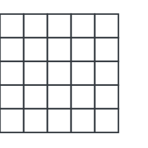
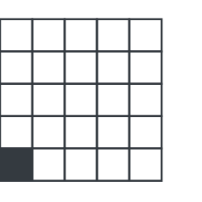
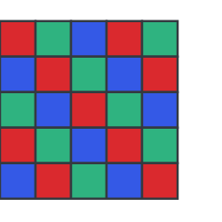
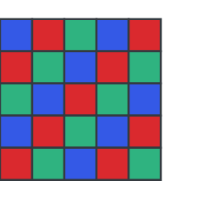
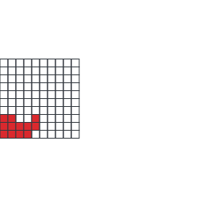

# 26 Prosessit ja algoritmit

    Tekijä

Olli Järviniemi

     

## 26.1 Johdanto

Joissakin kombinatoriikan tehtävissä tulee vastaan prosessi, jota pitää analysoida ja todistaa jokin tietty ominaisuus (kuten että prosessi jossain kohtaa päättyy). Joissakin tehtävissä pitää taas itse keksiä prosessi, jolla on tietyt ominaisuudet. Tässä tekstissä käsitellään tämäntyyppisiä tehtäviä.

Monissa prosessitehtävissä on jokin suure, joka käyttäytyy jollain tavalla säännöllisesti ja jonka kautta tehtävän saa ratkaistua. Tällaisia suureita kutsutaan **invarianteiksi**. Tätä ideaa käsitellään heti aluksi.

  

## 26.2 Invariantit

**Invariantti:** suure, joka ei muutu prosessin aikana.

Laatoitukset ovat klassisia esimerkkejä invarianteista: värittämällä ruudukko sopivasti huomataan, ettei sen laatoittaminen tietyillä palikoilla onnistu. Otetaan tästä esimerkki.

       

**Tehtävä 26.1** $5 \times 5$ -ruudukosta poistetaan jokin ruutu. Käy niin, että loput $24$ ruutua voidaan peittää $1 \times 3$ -laatoilla. (Palikoita saa kääntää, mutta ne eivät saa mennä toistensa päälle tai laudan ulkopuolelle.) Osoita, että poistettu ruutu on laudan keskellä sijaitseva ruutu.

     

  

* Kuva 26.1: $5 \times 5$ -lauta. *

On helppo keksiä laatoitus tapauksessa, jossa keskimmäinen ruutu poistetaan. Mutta miksei laatoitus onnistu muissa tapauksissa? Tutkitaan esimerkkitapausta.

 

  

* Kuva 26.2: Miksei tämän laudan laatoitus onnistu? *

Ideana on värittää laudan ruudut siten, että osaamme sanoa jotakin siitä, montako kunkin värin ruutua jokainen laatta peittää. Luonteva idea on värittää lauta kolmella värillä niin, että kukin laatta peittää yhden ruudun kutakin väriä. Tämä onnistuu seuraavasti:

 

  

* Kuva 26.3: Laudan väritys kolmella värillä. *

Jokainen $1 \times 3$ -laatta peittää yhden ruudun kutakin väriä. Punaisia ruutuja on kuitenkin $9$ ja sinisiä $7$, joten toisaalta peittämiseen tulisi käyttää $9$ laattaa ja toisaalta $7$. Tämä ei tietysti käy.

Koko tehtävän saa ratkaistua tällä idealla. Tutkitaan alla olevia värityksiä.

 

    

* Kuva 26.4: Kaksi väritystä. *

Kummassakin värityksessä on $9$ punaista ruutua ja $8$ sinistä ja $8$ vihreää ruutua. Jotta laatoitus onnistuu, tulee laudalta poistaa sellainen ruutu, joka on punainen sekä vasemmassa että oikeassa värityksessä. Ainoa tällainen ruutu on laudan keskimmäinen ruutu, eli laatoitus onnistuu vain jos keskimmäinen ruutu poistetaan.

Tässä on toinen esimerkkitehtävä, joka on enemmän prosessimainen.

       

**Tehtävä 26.2** Liitutaululla on kirjoitettuna luvut $1, 2, \ldots, 100$. Anna tekee toistuvasti seuraavan operaation: valitaan jotkin kaksi taulun lukua $A$ ja $B$, pyyhitään ne ja kirjoitetaan taululle luku $AB + A + B$. Näin tehdään, kunnes taululla on vain yksi luku. Osoita, että lopuksi taululla oleva luku on sama riippumatta siitä, missä järjestyksessä Anna valitsee lukuja.

Tehtävässä on kätkettynä jokin invariantti: riippumatta siitä, mitä Anna tekee, jokin suure pysyy samana. Mikä tämä suure on?

Pyöritellään ideoita mielessä. Mitä suureita ylipäätään pystymme muodostamaan luvuista? Voimme tutkia lukujen summaa. Tämä ei tietenkään pysy samana: $AB + A + B \neq A + B$. Huomataankin, että luvut kasvavat hyvin nopeasti, minkä takia summa ei todellakaan toimi.

Kasvunopeudesta johtuen lukujen tulo tuntuu paremmalta idealta, mutta tämäkään ei toimi, koska $AB + A + B \neq A \cdot B$. Tämä on kuitenkin jo lähempänä: $AB + A + B$ ja $AB$ ovat kohtalaisen lähellä toisiaan.

Suure todennäköisesti liittyy jotenkin lukujen tuloihin, muttei ole selvää miten. Voi auttaa tutkia pieniä tapauksia, joissa taululla on aluksi vähemmän kuin sata lukua. Lopussa olevan luvun selvittämiseksi riittää käydä vain yksi skenaario läpi, koska vastaus ei tehtävänannon mukaan riipu järjestyksestä (vaikkemme tätä vielä osaakaan todistaa).

- Taululla on aluksi luvut $1$ ja $2$. Lukujen tulo on $2$. Lopuksi taululla on luku $5$.
- Taululla on aluksi luvut $1, 2$ ja $3$. Lukujen tulo on $6$. Lopuksi taululla on luku $23$.
- Taululla on aluksi luvut $1, 2, 3$ ja $4$. Lukujen tulo on $24$. Lopuksi taululla on luku $119$.
- Taululla on aluksi luvut $1, 2, 3, 4$ ja $5$. Lukujen tulo on $120$. Lopuksi taululla on luku $719$.

Säännönmukaisuus alkaa erottumaan: lukujen ollessa $1, 2, \ldots, n$ on vastaus $$(n+1)! - 1 = 1 \cdot 2 \cdot 3 \cdot \ldots \cdot (n+1) - 1.$$ Lukuja tulee siis jotenkin kasvattaa yhdellä.

Tästä keksitään ratkaisu: haluttu suure on tulo luvuista, jotka vastaavat taulun lukuja mutta joihin on jokaiseen lisätty yksi. Pätee nimittäin $AB + A + B + 1 = (A+1)(B+1)$. Tämä suure ei muutu ja aluksi se on $(n+1)!$. Täten lopussa olevan luvun tulee olla $(n+1)! - 1$.

Esitetään vielä yksi opettavainen esimerkki samasta teemasta.

       

**Tehtävä 26.3** Olkoot $k$ ja $n$ positiivisia kokonaislukuja. Anna ja Bella pelaavat peliä laudalla, joka koostuu $n+1$ ruudusta, jotka on numeroitu $0, 1, \ldots, n$. Pelin alussa ruudussa $0$ on $k$ kolikkoa. Muut ruudut ovat tyhjiä. Kullakin vuorolla Anna valitsee kaksi epätyhjää kolikoiden joukkoa $A$ ja $B$ laudalta niin, etteivät $A$ ja $B$ sisällä yhteisiä kolikoita (mutta joukkojen $A$ ja $B$ ei tarvitse sisältää kaikkia laudan kolikoita). Bella valitsee joukoista $A$ ja $B$ jommankumman ja poistaa valitsemansa joukon kolikot laudalta. Jäljelle jäävän joukon kolikoita siirretään yksi ruutu eteenpäin. Anna voittaa pelin, jos hän siirrettyä vähintään yhden kolikon ruutuun $n$, ja Bella voittaa, mikäli hän saa tyhjennettyä laudan kolikoista.

Osoita, että Annalla on voittostrategia jos ja vain jos $k \ge 2^n$.

Voittostrategia Annalle tapauksessa $k = 2^n$ (ja siten tapauksessa $k \ge 2^n$) on helppo keksiä: jaetaan nykyinen joukko aina kahtia, jolloin toinen puolisko pääsee yhden askeleen eteenpäin. Tällöin aina ruutuun $i$ siirretään $2^{n - i}$ kolikkoa, joten ruutuun $n$ siirretään $2^0 = 1$ kolikko.

Tapauksessa $k < 2^n$ pitää keksiä Bellalle voittostrategia. Parikin strategiaa tulee mieleen:

- Bella poistaa aina sen joukon, jossa on etummaisin kolikko (ja tasatilanteet käsitellään jotenkin).
- Bella poistaa aina sen joukon, jossa on enemmän kolikoita (ja tasatilanteet käsitellään jotenkin).

Ikävä kyllä kumpikaan näistä ei toimi: Anna voi antaa Bellalle ”syöttejä” ja näin hyödyntää Bellan strategian heikkouksia.

Ongelma on siinä, etteivät strategiat ota kunnolla huomioon kokonaiskuvaa. Ensimmäinen strategia ottaa huomioon vain etummaiset kolikot. Toinen strategia sentään katsoo kolikoiden määriä, muttei ota niiden sijainteja kunnolla huomioon. Seuraava ratkaisu korjaa nämä ongelmat ottaen jokaisen kolikon sijainnin huomioon.

Määritellään kolikon *tärkeys* olemaan $2^m$, missä $m$ on kolikon nykyinen ruutu. Bellan strategia on aina poistaa se kolikkojoukko, jonka kolikoiden tärkeyksien summa on suurempi (tasatilanteessa poistetaan kumpi tahansa).

**Väite.** Kun Bella pelaa näin, laudalla olevien kolikoiden tärkeyksien summa ei koskaan kasva.

**Väitteen perustelu.** Oletetaan, että Anna valitsee kolikkojoukot $A$ ja $B$, joiden kolikoiden tärkeyksien summat ovat $a$ ja $b$. Jos $a \ge b$, Bella poistaa joukon $A$ kolikot, ja $B$:n kolikot siirtyvät yhden askeleen eteenpäin. Joukon $B$ jokaisen kolikon tärkeys kaksinkertaistuu, joten tärkeyksien summakin kaksinkertaistuu, eli lisääntyy $b$:llä. Täten tärkeyksien summan muutos on $-a + b \le 0$. Tapaus $b \ge a$ on symmetrinen.

**Ratkaisun viimeistely.** Alussa tärkeyksien summa on $k < 2^n$. Jos Anna saisi jossakin vaiheessa kolikon ruutuun $n$, olisi tämän kolikon tärkeys $2^n$. Tämä on ristiriidassa sen kanssa, ettei tärkeyksien summa kasva.

**Kommentti.** Idea määritellä painoarvoja (tässä tapauksessa ”tärkeys” $2^m$) eri kolikoille on kohtuu yleinen. Painotus halutaan tietysti valita niin, että painoarvojen summa pysyy samana, ei koskaan kasva tai käyttäytyy muuten säännöllisesti. Tästä syystä $2^m$ on hyvä valinta tehtävään. Syy idean toimivuudelle selitettiinkin ratkaisussa: tutkimalla painoarvojen summaa saadaan otettua jokainen kolikko huomioon keskittyen kuitenkin enemmän pitkälle edenneisiin kolikoihin.

     

## 26.3 Muita esimerkkejä

       

**Tehtävä 26.4** $10 \times 10$ -ruudukon ruuduissa on yhteensä tuhat sammakkoa. (Samassa ruudussa voi olla useampi sammakko.) Sammakot hyppivät ruuduista toiseen seuraavan säännön mukaisesti: jos ruudussa on vähintään ruudun naapurien määrän verran sammakkoja, ruudusta hyppää kuhunkin naapuriruutuun yksi sammakko. (Ruudun naapureita ovat ne ruudut, joilla on yhteinen sivu tai kärkipiste ruudun kanssa.) Osoita, että kussakin ruudussa käy jossain kohtaa vähintään yksi sammakko.

Ennen väitteen todistamista pohditaan hetki, mitä prosessissa oikein tapahtuu. Lähteekö prosessi edes liikkeelle? Lähtee: Jos jossakin ruudussa on vähintään $8$ sammakkoa, ruudusta hyppää sammakoita muualle. Koska alussa sammakoita on tuhat ja ruutuja sata, on jossakin ruudussa aluksi vähintään kahdeksan (ja jopa vähintään kymmenen) sammakkoa.

Samaan tapaan huomataan, että prosessi ei pääty missään vaiheessa.

Väitteen todistamiseksi voisi miettiä, missä ruuduissa käy vähintään yksi sammakko. Tämä ei kuitenkaan kerro juuri mitään.

 

  

* Kuva 26.5: Ei kerro vielä kovin paljoa, että tiedämme punaisissa ruuduissa olevan jossain vaiheessa vähintään yksi sammakko. *

Sen sijaan parempi kysymys on miettiä, mihin ruutuihin tulee prosessin aikana sammakko äärettömän monta kertaa. Tiedämme, että vähintään yksi tällainen ruutu on olemassa, koska prosessi jatkuu loputtomiin. Ei ole myöskään vaikea nähdä, että jos ruudulla on tämä ominaisuus, niin myös ruudun naapureilla on tämä ominaisuus, koska ruudusta hyppii sen naapureihin äärettömän monta sammakkoa prosessin aikana.

Tästä seuraa, että jokaiseen ruutuun hyppää prosessin aikana äärettömän monesti sammakko.

       

**Tehtävä 26.5** Annalla on robotteja, jotka hän on laittanut (äärellisen) ruudukon ruutuihin. Mihin tahansa ruutuun mahtuu rajattomasti robotteja. Joidenkin ruudukon ruutujen välillä on seiniä, joiden läpi robotit eivät voi kulkea. Lisäksi robotit eivät voi kulkea ruudukon ulkoreunojen läpi.

Anna antaa roboteille käskyjä ”ylös”, ”vasen”, ”alas” ja ”oikea”. Käskyn annettuaan jokainen roboteista yrittää kulkea käskyn ilmoittamaan suuntaan yhden ruudun verran. Jos vastassa on seinä, robotti ei liiku.

Oletetaan, että mistä tahansa ruudukon ruudusta pääsee mihin tahansa muuhun ottamalla askeleita ylös, vasemmalle, alas tai oikealle. Osoita, että Anna voi antaa roboteille käskyjä niin, että lopuksi kaikki robotit ovat samassa ruudussa.

*Ruudukko, seiniä ja kolme robottia.*

Yllä oleva kuva esittää yhden esimerkkitapauksen. Esimerkki ei ole kovin vaikea: voimme vaikkapa aluksi tehdä kolme askelta vasemmalle ja kolme askelta alas, jolloin kaksi robottia saadaan samaan ruutuun vasempaan alanurkkaan. Tämän jälkeen tekemällä kolme askelta ylös ja kolme vasemmalle saadaan kolmaskin robotti samaan ruutuun.

Yleisesti huomataan, että riittää ratkaista tehtävä kahden robotin tapauksessa. Jos nimittäin robotit jossain kohtaa päätyvät samaan ruutuun, ne ovat aina samassa ruudussa.

Kahden robotin tapaus ei ole aivan helppo. Esimerkiksi yksinkertainen suunnitelma ”kuljetetaan ensiksi toinen roboteista vasempaan alanurkkaan, ja viedään sitten toinenkin roboteista sinne” ei välttämättä toimi: ensimmäinen robotti saattaa (ainakin periaatteessa) ”karata” sillä välin kun keskitytään toiseen robottiin.

Mietitään asiaa toisesta näkökulmasta: yritetään saada robotit koko ajan lähemmäksi toisiaan.

Tarkemmin sanoen määritellään kahden ruudun etäisyydeksi pienin määrä askelia, joka tarvitaan ensimmäisestä ruudusta toiseen ruutuun pääsemiseksi. Tavoitteena on saada liikutettua robotteja niin, että niiden ruutujen väliset etäisyydet pienenevät.

Jos robottien etäisyys on aluksi yksi, eli esimerkiksi toinen roboteista on toisen oikealla puolella ja ruutujen välillä ei ole seinää, voidaan vain toistuvasti liikkua oikealle. Jossakin kohtaa etummaiselle robotille tulee seinä vastaan, jolloin robotit päätyvät samaan ruutuun.

Tutkitaan sitten yleisesti tilannetta, jossa robottien etäisyys on $n$, eli ensimmäisen robotin ruudusta pääsee toisen robotin ruutuun jollakin $n$ siirron sarjalla (muttei nopeampaa). Suoritetaan tämä $n$ siirron sarja. Mitä tapahtuu? Robottien etäisyys on siirtosarjan jälkeen selvästikin enintään $n$. Jos se on alle $n$, olemme saaneet robotit lähemmäksi toisiaan.

Entä jos etäisyys on edelleen $n$? Tämä tarkoittaa, että toinen robotti ei törmännyt seinään kertaakaan siirtosarjan aikana. Tämä puolestaan tarkoittaa, että (yksi) nopein tapa päästä ensimmäisen robotin ruudusta toiseen on käyttää *samaa* $n$ siirron sarjaa kuin aiemminkin. Suoritetaan siirtosarja siis uudestaan ja tarvittaessa vielä useamman kerran uudestaan.

*Siirtosarja ensimmäisestä robotista toiseen on merkitty kuvaan punaisella. Jos robotit eivät lähene toisiaan siirtosarjan seurauksena, toinen robotti ei törmää seinään siirtosarjan aikana.*

Voiko olla niin, että vaikka tämän siirtosarjan tekisi kuinka monta kertaa tahansa, niin robottien etäisyys olisi edelleen $n$? Ei: siirtosarjan seurauksena robotit kulkevat johonkin suuntaan aloitusruudusta. Toistamalla siirtosarjaa robotit kulkevat pidemmälle ja pidemmälle tähän suuntaan. Jossakin vaiheessa ruudukon reuna tulee vastaan.

Siis toistamalla siirtosarjaa riittävän monta kertaa saadaan robotit lähemmäksi toisiaan. Toistamalla samaa ideaa saadaan robotit yhä lähemmäs ja lähemmäs toisiaan, kunnes ne ovat samassa ruudussa.

  

## 26.4 Tehtäviä

**Tehtävä 1.** $8 \times 8$ -shakkilaudasta poistetaan kaksi vastakkaista nurkkaruutua. Osoita, ettei lautaa voi peittää $2 \times 1$ -dominopalikoilla. (Palikoita saa kääntää, mutta ne eivät saa mennä toistensa päälle tai laudan ulkopuolelle.)

**Tehtävä 2.** Ringissä on $100$ kuppia. Aluksi kaikki paitsi yksi kupeista on oikein päin. Kupeista valitaan aina jotkin kaksi ja ne käännetään toisin päin. Onko mahdollista päästä tilanteeseen, jossa kaikki kupit ovat oikein päin?

**Tehtävä 3.** Juhlissa olevista henkilöistä tiedetään, että kukin heistä tuntee enintään kolme muuta henkilöä juhlista. Osoita, että henkilöt voidaan jakaa neljään joukkoon niin, etteivät ketkään kaksi saman joukon henkilöä tunne toisiaan.

**Tehtävä 4.** Pyöreän pöydän ympärillä istuu $25$ poliitikkoa, jotka äänestävät. Ensimmäisellä äänestyskierroksella jokainen äänestää satunnaisesti joko ”Kyllä” tai ”Ei”. Jokaisella seuraavista kierroksista jokainen poliitikko äänestää seuraavasti:

- Jos vähintään toinen poliitikon vierustovereista äänesti edellisellä kerralla samoin kuin poliitikko itse, niin poliitikko äänestää samoin kuin edellisellä kerralla.
- Muussa tapauksessa poliitikko äänestää päinvastoin kuin edellisellä kierroksella.

Osoita, että jostain kierroksesta lähtien kenenkään poliitikon ääni ei enää muutu.

**Tehtävä 5.** Pöydällä on $n > 1$ kolikkoa. Yhdellä operaatiolla saa ottaa kaksi kolikkoa ja siirtää molemmat niistä kolikoiden välisen janan keskipisteeseen.

- Osoita, että jos $n = 2^k$ jollain $k \ge 1$, niin operaatiota toistamalla on mahdollista saada kaikki kolikot samaan pisteeseen (riippumatta kolikoiden alkusijainneista).
- Osoita, että jos $n$ ei ole kakkosen potenssi, niin on mahdollista asettaa kolikot pöydälle niin, että kolikoita ei saa samaan pisteeseen.

---

原文：[https://kurssi.matematiikkakilpailut.fi/26_prosessit_ja_algoritmit.html](https://kurssi.matematiikkakilpailut.fi/26_prosessit_ja_algoritmit.html)
