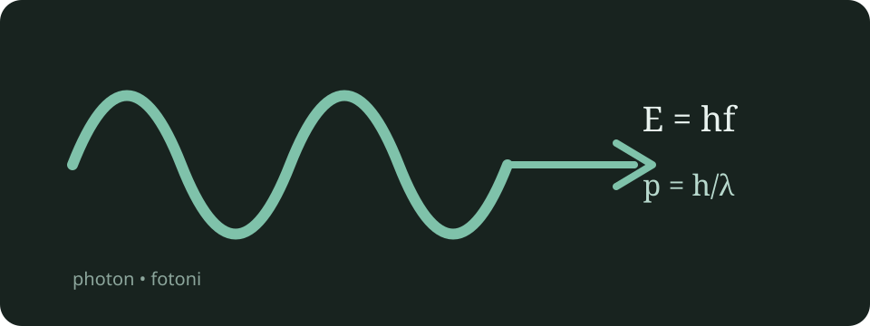

# Kvanttifysiikka

Kvanttifysiikassa energia esiintyy usein pieninä annoksina eli **kvantteina**.

## Fotoni

Fotoni on sähkömagneettisen säteilyn kvantti. Fotonin energia on

$$
E = hf = \frac{hc}{\lambda}.
$$

Inline-kaavana fotonin liikemäärä on $p = h/\lambda$.

### Suureet ja yksiköt

| Suure | Tunnus | SI-yksikkö |
|---|---:|---:|
| Energia | $E$ | J |
| Taajuus | $f$ | Hz |
| Aallonpituus | $\lambda$ | m |

## Kuvaesimerkki

Alla oleva kuva sijaitsee Markdown-tiedoston lähellä olevassa `images`-kansiossa. Rakennus kopioi sen automaattisesti julkaistavaksi.



## Tehtävälista

- [x] Opiskele fotonin energia.
- [ ] Harjoittele Comptonin sirontaa.

## Koodiesimerkki

```python
PLANCK = 6.626_070_15e-34

def photon_energy(frequency_hz: float) -> float:
    """Return photon energy in joules."""
    return PLANCK * frequency_hz
```

---

> **Muista:** taajuus kasvaa, kun aallonpituus pienenee, koska $c = f\lambda$.
